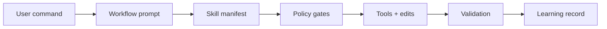
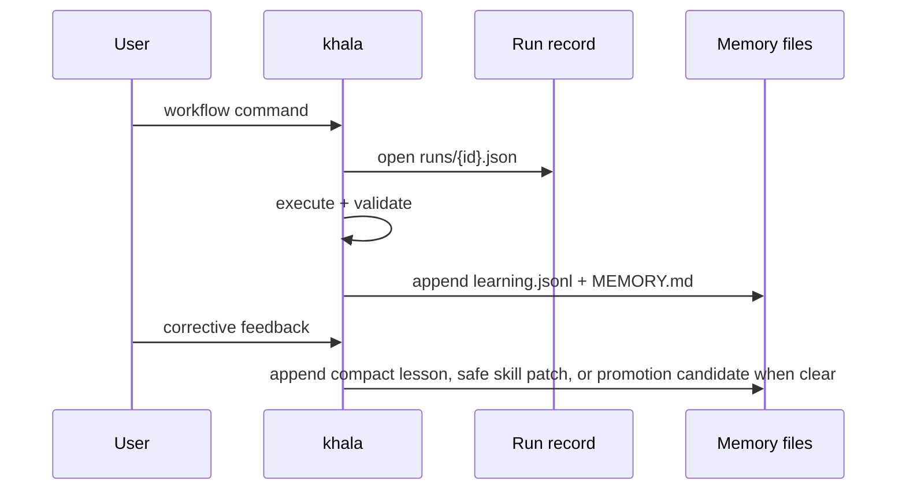

<div align="center">

# khala

**A guarded, self-learning Pi coding-agent runtime for pragmatic engineering work.**

<p>
  <a href="https://github.com/pesap/agents/blob/main/LICENSE.txt"></a>
  
  
  
</p>

</div>


## Quick start

```bash
pi install https://github.com/pesap/agents
```

Inside Pi:

```text
/khala
```

One-shot (no install):

```bash
pi -e https://github.com/pesap/agents -p "/khala"
```

---

## What khala adds

| Capability | Description |
|---|---|
| **Workflow commands** | Debug, triage, plan, workon, review, inbox, simplify, ship, and skill creation workflows. |
| **Safety gates** | Risk approval, preflight/postflight evidence, blocked destructive commands, response compliance, anti-stall turn obligations. |
| **Local-first learning** | File-backed workflow observations and corrective lessons with quality gates; no model fine-tuning or transcript storage. |
| **Bundled tooling** | Pi extensions for fast search (`@ff-labs/pi-fff`) and subagent workflows (`pi-subagents`). |

> [!IMPORTANT]
> khala favors minimal, reversible changes. High-risk operations require explicit checker approval.

---

## Core flow



---

## Commands

### Core workflows

| Command | Purpose |
|---|---|
| `/debug <unreported-problem>` | Investigate a maintainer-observed symptom, gather evidence, and draft a new issue proposal after approval. |
| `/triage <issue-url\|user-posted-request>` | Clean user-posted issue/request intake into a `/workon`-ready work packet, asking approval before forge updates. |
| `/plan <topic>` | Shape maintainer planned changes or codebase improvement ideas into scoped issue/work packet(s) with a slice table before issue creation. |
| `/workon <issue-url\|issue-number> [--repo owner/repo] [--forge auto\|github\|gitlab\|all] [--dry-run] [--model MODEL]` | Start autonomous work by default only when the issue passes the readiness rubric; child Pi launches pin the workon default model and thinking level, and `--dry-run` prepares only the capsule and branch suggestion. |
| `/review [scope] [--extra "focus"]` | Review changes by scope: uncommitted, branch, commit, PR, folder, file, or paths. |
| `/git-review` | Run git-history diagnostics before reading code. |
| `/simplify [scope] [--extra "focus"]` | Behavior-preserving simplification and slop cleanup. |
| `/ship [extra instruction]` | Simplify, validate, commit, push, and open/confirm PR/MR. |
| `/inbox [--scope auto\|current\|global] [--global] [--focus all\|reviews\|issues\|prs\|ci\|local\|sessions] [--repo owner/repo] [--user [login\|@me]] [--forge auto\|github\|gitlab\|all] [--limit N] [--details\|--evidence]` | Show a compact read-only maintainer dashboard from local, forge, and session signals. Defaults to global mode outside git repos for side-terminal dashboards; pass `--details` for full deterministic evidence. |
| `/audit <claim>` | Anti-confirmation-bias claim audit with evidence-ranked revision. |
| `/address-open-issues [--limit N] [--repo owner/repo]` | Sweep open GitHub issues authored by the current user through triage, workon, review, and remediation. |
| `/learn-skill <topic> [--from <path\|url>] [--dry-run]` | Create or refine a reusable skill in the learning store. |

For a parked maintainer side terminal, run `/inbox` from a non-git directory such
as `$HOME`; that defaults to the global queue. From inside a repository, `/inbox`
stays repo-scoped unless you pass `--global` or `--scope global`. The default
human output is a compact dashboard:

```text
Inbox · 2026-06-06 00:12 · partial
GitHub ok · local skipped

Do next
1. NatLabRockies/R2X #256: Review request — review requested pr, updated 2026-06-05T00:00:00Z
   /review pr https://github.com/NatLabRockies/R2X/pull/256

Counts: reviews 1, broken CI 0, blocked sessions 0, issues 0, local 0
Gaps: local collector skipped for focus=reviews
```

Pass `--details` or `--evidence` to include repository discovery, full bucketed
item lists, evidence gaps, and read-only command dumps.

<details>
<summary><strong>Run workflows outside the REPL</strong></summary>

```bash
pi -e https://github.com/pesap/agents -p "/review README.md --extra 'focus on correctness'"
pi -e https://github.com/pesap/agents -p "/review https://github.com/owner/repo/pull/123"
pi -e https://github.com/pesap/agents -p "/simplify src/commands/review.ts"
pi -e https://github.com/pesap/agents -p "/ship"
pi -e https://github.com/pesap/agents -p "/plan 'Add retry policy for hook loading'"
```

</details>

### Policy & rule control

| Command | Purpose |
|---|---|
| `/khala` | Initialize khala and set compliance to `warn`. |
| `/khala status\|strict\|enforce\|warn\|monitor\|reset` | Report or change compliance mode. |
| `/end-agent` | Disable khala session context injection. |
| `/approve-risk <reason> [--ttl MINUTES]` | Approve one high-risk command (TTL 1–120 min, default 20). |
| `/preflight Preflight: skill=<name\|none> reason="<short>" clarify=<yes\|no>` | Record manual mutation intent. |
| `/postflight Postflight: verify="<command>" result=<pass\|fail\|not-run>` | Record verification evidence. |

### Learned skills & rules

| Command | Purpose |
|---|---|
| `/skill-status <name>` | Show learned skill provenance and lifecycle state. |
| `/skill-report` | Regenerate the learned skill curator report. |
| `/pin-skill <name> [on\|off]` | Pin or unpin a learned skill. |
| `/archive-skill <name>` | Archive a learned skill. |
| `/restore-skill <name>` | Restore an archived learned skill. |
| `/khala-reload` | Reload Pi resources so learned skills and workflows become slash commands. |
| `/workflow-list` | List reviewed khala learned workflows. |
| `/workflow-show <name>` | Show a learned workflow artifact and prompt template. |
| `/workflow-run <name> [input]` | Run a learned workflow with optional input. |
| `/rule-list [--all]` | List active khala runtime rules. |
| `/rule-show <id>` | Show a runtime rule and its structured metadata. |
| `/rule-audit [--limit N]` | Show recent rule promotion, disable, reload, hit, warn, and block events. |
| `/rule-promote <candidate-id> [--enforce\|--warn\|--advisory]` | Promote a candidate rule to active. |
| `/rule-session <trigger> => <instruction>` | Add a per-session runtime rule (expires on shutdown). |
| `/rule-replace <id> key=value [...]` | Append a replacement record for a runtime rule. |
| `/rule-disable <id> <reason>` | Disable a runtime rule. |
| `/rule-reload` | Parse user edits from `rules/RULES.md` and append valid replacements. |

---

## Rules, simplified

Three layers of rules:

1. **Packaged defaults** — always-on rules shipped in `runtime/RULES.md`.
2. **Persistent user/repo rules** — durable local rules added with `/rule-add <trigger> => <instruction>` and mirrored to `.pi/khala/rules/RULES.md` (or `~/.pi/khala/rules/RULES.md` when no repo-local `.pi/` exists). If you edit `RULES.md` by hand, run `/rule-reload`.
3. **Session-only rules** — temporary rules added with `/rule-session <trigger> => <instruction>`.

Use `runtime/RULES.md` to change default shipped behavior. Use `/rule-add` for local or repo-specific persistent rules. Use `/rule-session` for temporary guidance.

### Runtime rule examples

Add a durable repo/user rule that should be available in future sessions:

```text
/rule-add mutation work => Read memory and search task-specific lessons before editing files. --warn
```

Add a stricter durable rule:

```text
/rule-add destructive commands => Stop and ask for explicit approval before destructive filesystem or git operations. --enforce
```

Add a temporary rule for only the current session:

```text
/rule-session current debugging task => Prefer evidence-backed root-cause analysis before proposing fixes. --advisory
```

List active runtime rules and the resolved store path:

```text
/rule-list
```

If you manually edit `.pi/khala/rules/RULES.md`, reload it into the runtime JSONL store:

```text
/rule-reload
```

---

## Runtime behavior

When khala is enabled (`/khala` or any khala workflow command), the harness provides:

- **Policy-checked commands** — `bash` and mutation calls are gated through risk approval.
- **Evidence requirements** — preflight before mutation, postflight after, result/confidence footer on workflow output.
- **Anti-stall enforcement** — low-confidence answers, repeated tool failures, and duplicate evidence calls are flagged and escalated.
- **Skill routing** — explicit and implicit skill loads are verified; placeholder results are rejected.
- **Source tracking** — local artifacts, external docs, command evidence, and citations are matched to tool calls.
- **Memory hygiene** — task-specific `khala_search_memory` refreshes are required before mutation turns.
- **Learning persistence** — `khala_learn` stores durable lessons when quality gates pass.

<details>
<summary><strong>Full harness rule reference</strong></summary>

<ul>
  <li><code>bash</code> calls are policy-checked.</li>
  <li>On Windows, khala can override <code>bash</code> to execute via PowerShell when the parent shell is PowerShell. Set <code>KHALA_FORCE_POWERSHELL_BASH=true|false</code> to force or disable this override, and <code>KHALA_POWERSHELL_PATH</code> to pin a specific executable.</li>
  <li>Risky/destructive commands may be blocked unless approved.</li>
  <li>Low-confidence or knowledge-gap final answers are flagged, and in enforce mode blocked. Stronger advisory model escalation must have concrete task context beyond a bare "low confidence" reason, and a substantive successful advisory result that matches the escalated question; the final answer must not still leave the uncertainty unresolved.</li>
  <li>Repeated tool failures trigger stronger-model escalation with the failed command/error context and require the latest advisory escalation to return a substantive result.</li>
  <li>Repeated identical evidence-tool calls, local evidence for the same file across different tools, equivalent <code>khala_search_memory</code> queries, equivalent external search queries, and repeated <code>khala_learn</code> storage are flagged.</li>
  <li>Tool results that report no usable evidence (empty results, generic acknowledgements, placeholders) do not satisfy evidence, memory, citation, skill, mutation, or escalation gates.</li>
  <li>Unbounded local shell evidence dumps are flagged in favor of bounded read/search tools.</li>
  <li>Broad memory and external evidence queries are flagged before they waste context.</li>
  <li>Substantial tool-backed work is checked for focused, task-specific <code>khala_search_memory</code> use; mutation turns require the latest focused matching search before the first mutation to succeed and still be fresh.</li>
  <li>Explicit named skill requests and assistant claims of named skill use require same-turn <code>SKILL.md</code> reads or explicit skill-assigned delegation with substantive output.</li>
  <li>Evidence routing distinguishes local artifacts from current/URL/docs/external facts; official-source requests require authority indicators.</li>
  <li>Assistant claims of verification, source backing, tool work, code changes, or test/build success require matching same-turn evidence.</li>
  <li>Citation/source/link requests require concrete URLs or local artifact references backed by same-turn evidence.</li>
  <li>Workflow commands create auto-preflight records; mutation workflows are checked for postflight evidence.</li>
  <li>Selected active runtime rules are injected as <code>[ACTIVE RUNTIME RULES]</code> before agent start.</li>
  <li>Final workflow responses are checked for <code>Bias Check (Tier 1)</code> plus <code>Result: success|partial|failed</code> and <code>Confidence: &lt;0..1&gt;</code> when response compliance is enabled.</li>
</ul>

</details>

Stronger-model escalation is a result contract: the advisory result must be substantive and matched to the escalated question. Same-model delegation, vague tasks, hedged results, and unresolved uncertainty remain blocked.

The harness is configured via `runtime/profile.yaml`:

```yaml
harness:
  bootstrap_memory_tail_lines: 8
  bootstrap_runtime_rules: 8
  substantial_tool_call_threshold: 4
  tool_failure_escalation_threshold: 3
```

Bootstrap limits keep the stable prompt prefix cache-friendly. Substantial turns should use `khala_search_memory` instead of expanding startup memory.

---

## Maintainer OS direction

The long-term maintainer-control-plane direction is captured in
[`docs/maintainer-os-north-star.md`](docs/maintainer-os-north-star.md).

## Configuration & layout

```text
.
├── commands/      # user-facing workflow prompts
├── workflows/     # workflow specs queued into Pi messages
├── skills/        # packaged reusable skills
├── extensions/    # Pi extension implementation
├── runtime/       # profile, compliance, hooks, and bootstrap docs
└── scripts/       # lightweight guard/regression checks
```

### Runtime config

| Path | Purpose |
|---|---|
| `runtime/profile.yaml` | Workflow enablement, prompt/spec names, low-confidence threshold, first-principles defaults. |
| `runtime/compliance/first-principles-gate.yaml` | Persistent compliance gate defaults. |
| `runtime/hooks/hooks.yaml` | Lifecycle hook configuration (paths constrained to `runtime/hooks/`). |
| `runtime/hooks/bootstrap.md` / `runtime/hooks/teardown.md` | Default session start/end hook docs. |

### Workflow prompts & specs

Workflow prompt frontmatter can set `skills:`. By default, khala injects a skill manifest (name, description, path). Set `skillContext: full` to inject full skill bodies, or `skillContext: none` to disable. Missing required skills stop the workflow before it is queued.

### Skills & learned skills

Package-registered skills come from `package.json` Pi config (`./skills` and `./node_modules/pi-subagents/skills`).

`/learn-skill` writes to the khala learning store, not to package `skills/`. Learned skills use a `khala-` prefix to avoid collisions with packaged/global Pi skills. After `/khala-reload`, learned skills are available as normal Pi skills via `/skill:<name>`.

### Memory tools

| Tool | Purpose |
|---|---|
| `khala_read_memory` | Read current memory context filtered by task/edit context when available: active runtime rules, relevant memory snippets, and contextual recent learnings. |
| `khala_search_memory` | Search older memory, runtime rules, learned skills, prompt templates, and workflow artifacts by relevance. |
| `khala_assess_learning` | Score whether a task produced a durable, non-sensitive lesson. |
| `khala_learn` | Persist a structured learning record. |

Learning persistence is conservative: a candidate must have a concrete trigger, a specific operating lesson, enough evidence, no sensitive material, and score/confidence at or above the storage threshold.

---

## Learning model

Learning is event-based memory, not model fine-tuning.



Durable artifacts are written to `<repo>/.pi/khala/` when `.pi/` exists in cwd, or `~/.pi/khala/` otherwise.

| File | Purpose |
|---|---|
| `memory/learning.jsonl` | Structured observations per workflow run. |
| `memory/lessons.jsonl` | Passive lessons from corrective normal prompts. |
| `memory/MEMORY.md` | Concise chronological learnings. |
| `memory/promotion-queue.md` | Promotion/improvement candidates from repeated outcomes. |
| `memory/skill-curator-report.md` | Learned-skill review notes and patch recommendations. |
| `rules/active.jsonl` | Durable active runtime rules with replacement records. |
| `rules/session.jsonl` | Per-session active rules, cleared on shutdown. |
| `rules/candidates.jsonl` | Proposed rules not yet active. |
| `rules/audit.jsonl` | Runtime rule hit/warn/block/reload audit events. |
| `rules/RULES.md` | Human-readable durable rule mirror. Prefer `/rule-add`; if edited by hand, run `/rule-reload`. |
| `runs/*.json` | Per-run workflow records. |
| `workflows/*.yaml` | Reviewed reusable workflow artifacts. |
| `prompts/*.md` | Pi prompt templates for reviewed workflows. |
| `skills/<name>/SKILL.md` | Main learned skill instructions. |
| `skills/<name>/metadata.json` | Learned skill provenance and lifecycle metadata. |
| `archive/skills/<name>/` | Recoverable archive for archived learned skills. |

<details>
<summary><strong>What is enforced vs. not enforced</strong></summary>

**Enforced** in configurable warn/enforce modes:

- preflight before mutation tools (`edit`, `write`, mutating `bash`)
- postflight evidence after mutation
- workflow response footer lines: `Result: ...` and `Confidence: 0..1`
- runtime checks for promise-only tool work, generic permission-question stalls, incomplete memory-gate recovery, and approval-required destructive requests
- learning quality gates before storage or promotion
- replay fixtures in `tests/runtime/fixtures/harness-replay.json` exercise end-to-end cheap-model failure modes

**Not automatic:**

- no automatic edits to `README.md`, `INSTRUCTIONS.md`, or user-authored/imported skills from learning
- no automatic hot-reload after background learning; run `/khala-reload` to refresh Pi resources
- no automatic runnable workflow creation from repeated success statistics; repeated outcomes create review candidates
- no model training/fine-tuning
- no raw transcript or full tool-output storage for passive normal-chat learning

</details>

---

## Compliance modes

```text
/khala enforce   # strict mode
/khala warn      # warnings only
/khala reset     # configured defaults
```

Persistent defaults live in `runtime/compliance/first-principles-gate.yaml`.

Strict mode behavior:

- Missing preflight before first mutation → mutation is blocked with remediation text.
- Missing postflight evidence after mutation → workflow is marked failed at completion.
- Missing final `Result:` / `Confidence:` lines in workflow output → response is blocked until fixed.

---

## Design goals

1. One canonical agent identity.
2. Learn from user feedback and workflow outcomes.
3. Stay concise/token-efficient by default.
4. Prefer transparent file-backed learning (`learning.jsonl`, `lessons.jsonl`, `MEMORY.md`).
5. Enable safe self-improvement with explicit guardrails.
6. Keep memory fresh during long or mutating tasks.
