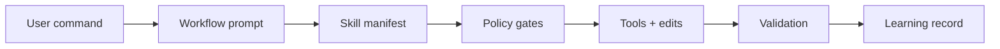
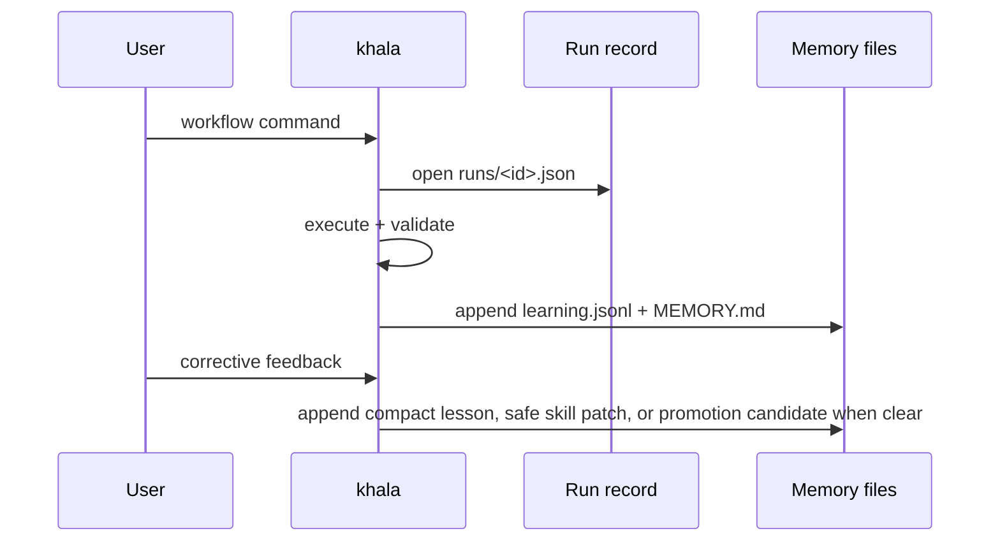

<div align="center">

# khala

**A guarded, self-learning Pi coding-agent runtime for pragmatic engineering work.**

<p>
  <a href="./LICENSE"></a>
  
  
</p>

</div>

---

## What khala adds

<table>
  <tr>
    <td><strong>Workflow commands</strong></td>
    <td>Debugging, review, simplification, planning, TDD, issue triage, shipping, and skill creation.</td>
  </tr>
  <tr>
    <td><strong>Safety gates</strong></td>
    <td>Risk approval, preflight/postflight evidence, blocked destructive commands, response compliance, and anti-stall turn obligations.</td>
  </tr>
  <tr>
    <td><strong>Local-first learning</strong></td>
    <td>File-backed workflow observations and corrective lessons with quality gates; no model fine-tuning or transcript storage.</td>
  </tr>
  <tr>
    <td><strong>Bundled tooling</strong></td>
    <td>Pi extensions for fast search (<code>@ff-labs/pi-fff</code>) and subagent workflows (<code>pi-subagents</code>).</td>
  </tr>
</table>

> [!IMPORTANT]
> khala favors minimal, reversible changes. High-risk operations require explicit checker approval.

## Quick start

```bash
pi install https://github.com/pesap/agents
pi
```

Inside Pi:

```text
/khala
```

Run once without installing:

```bash
pi -e https://github.com/pesap/agents -p "/khala"
```

## Core flow



## Commands

### Agent and policy control

| Command | Purpose |
| --- | --- |
| `/khala` | Initialize khala and set compliance mode to `warn` for the session. |
| `/khala status\|strict\|enforce\|warn\|monitor\|reset` | Report or change compliance mode. |
| `/end-agent` | Disable khala session context injection. |
| `/approve-risk <reason> [--ttl MINUTES]` | Approve one high-risk command. TTL defaults to 20 minutes and is capped to 1–120 minutes. |
| `/preflight Preflight: skill=<name\|none> reason="<short>" clarify=<yes\|no>` | Record manual mutation intent. |
| `/postflight Postflight: verify="<command_or_check>" result=<pass\|fail\|not-run>` | Record verification evidence. |
| `/skill-status <name>` | Show learned skill provenance and lifecycle state. |
| `/skill-report` | Regenerate the learned skill curator report from file-backed metadata. |
| `/pin-skill <name> [on\|off]` | Pin or unpin a learned skill. |
| `/archive-skill <name>` | Archive a learned skill without deleting it. |
| `/restore-skill <name>` | Restore an archived learned skill. |
| `/khala-reload` | Reload Pi resources so learned skills and workflow prompts become slash commands. |
| `/workflow-list` | List reviewed khala learned workflows. |
| `/workflow-show <name>` | Show a learned workflow artifact and its generated prompt template. |
| `/workflow-run <name> [input]` | Run a learned workflow by sending it to the agent with optional input. |
| `/rule-list [--all]` | List active khala runtime rules. |
| `/rule-show <id>` | Show a runtime rule and its structured metadata. |
| `/rule-promote <candidate-id> [--enforce\|--warn\|--advisory]` | Promote a candidate rule to active. |
| `/rule-session <trigger> => <instruction>` | Add a per-session runtime rule that expires on session shutdown. |
| `/rule-replace <id> key=value [...]` | Append a replacement record for a runtime rule. |
| `/rule-disable <id> <reason>` | Disable a runtime rule. |
| `/rule-audit [--limit N]` | Show recent rule promotion, disable, reload, hit, warn, and block events. |
| `/rule-reload` | Parse user edits from `rules/RULES.md` and append valid replacements. |

### Rules, simplified

There are three rule layers:

1. **Packaged defaults** — always-on rules shipped in `runtime/RULES.md`.
2. **Persistent user/repo rules** — editable rules stored in `.pi/khala/rules/RULES.md` (or `~/.pi/khala/rules/RULES.md` when no repo-local `.pi/` exists). After editing that file, run `/rule-reload`.
3. **Session-only rules** — temporary rules added with `/rule-session <trigger> => <instruction>`.

Use `runtime/RULES.md` when changing the default behavior that ships with khala. Use `.pi/khala/rules/RULES.md` for local or repo-specific persistent rules. Use `/rule-session` for temporary guidance.

### Workflow commands

These are registered and enabled by default unless `runtime/profile.yaml` disables them or their prompt/spec files fail validation.

| Command | Purpose |
| --- | --- |
| `/debug <problem> [--fix]` | Investigate a failure and optionally apply the smallest safe fix. |
| `/feature <request> [--ship]` | Deliver a scoped feature with tests/docs planning. |
| `/review [scope] [--extra "focus"]` | Review changes by scope: uncommitted, branch, commit, PR, folder, file, or paths. |
| `/git-review` | Run git-history diagnostics before reading code. |
| `/simplify [scope] [--extra "focus"]` | Behavior-preserving simplification and slop cleanup. |
| `/ship [extra instruction]` | Simplify, validate, commit, push, and open/confirm PR/MR. Uses GitButler target selection. |
| `/plan <plan_or_topic>` | Stress-test a plan and capture terms/ADRs when needed. |
| `/audit <claim>` | Run a full anti-confirmation-bias claim audit and revise confidence from evidence. |
| `/triage-issue <problem_statement>` | Investigate a bug and prepare a TDD fix plan/PR. |
| `/tdd <goal> [--lang auto\|python\|rust\|c]` | Run strict red-green-refactor delivery. |
| `/address-open-issues [--limit N] [--repo owner/repo]` | Sweep open GitHub issues authored by the current user. |
| `/learn-skill <topic> [--from <path\|url>] [--dry-run]` | Create or refine a reusable skill in the learning store. |

<details>
<summary><strong>Run workflows outside the REPL</strong></summary>

```bash
pi -e https://github.com/pesap/agents -p "/review README.md --extra 'focus on correctness'"
pi -e https://github.com/pesap/agents -p "/review https://github.com/owner/repo/pull/123"
pi -e https://github.com/pesap/agents -p "/simplify src/commands/review.ts"
pi -e https://github.com/pesap/agents -p "/ship"
pi -e https://github.com/pesap/agents -p "/tdd 'Add retry policy for hook loading' --lang rust"
```

</details>

## Runtime behavior

When khala is enabled (`/khala` or any khala workflow command):

<ul>
  <li><code>bash</code> calls are policy-checked.</li>
  <li>On Windows, khala can override <code>bash</code> to execute via PowerShell when the parent shell is PowerShell.</li>
  <li>Set <code>KHALA_FORCE_POWERSHELL_BASH=true|false</code> to force or disable this override, and <code>KHALA_POWERSHELL_PATH</code> to pin a specific executable.</li>
  <li>Risky/destructive commands may be blocked unless approved.</li>
  <li>Low-confidence or knowledge-gap final answers, including “best guess,” “may be wrong,” “cannot access,” “knowledge cutoff,” “no web access,” “without seeing the logs/file,” “I’d need to see the logs to confirm,” “no way to verify,” “don’t have visibility into,” or “not enough context” language, are flagged, and in enforce mode blocked. Stronger advisory model escalation must have concrete task context beyond a bare “low confidence” reason, and a substantive successful advisory result that matches the escalated question; the final answer must not still leave the uncertainty unresolved.</li>
  <li>Repeated tool failures trigger stronger-model escalation with the failed command/error context and require the latest advisory escalation to return a substantive result, such as a root cause, recommendation, verified answer, or evidence-backed finding, so the agent does not keep guessing after failed commands. Merely labeling a result as “advisory” or echoing the escalated task does not count. Failure detection includes nonzero exit status/code text and common system/network errors such as <code>EACCES</code>, <code>ENOENT</code>, <code>ECONNRESET</code>, and <code>ETIMEDOUT</code>. Escalation tasks for current, docs, release, or external facts must name the product, API, package, URL, artifact, or exact question instead of vague targets such as “latest docs.”</li>
  <li>Repeated identical evidence-tool calls are flagged so agents reuse observations instead of spending extra tokens on duplicate reads or searches.</li>
  <li>Repeated local evidence for the same file/path across different tools, such as <code>read ./README.md</code> followed by <code>sed -n ... README.md</code>, is flagged after local path normalization unless a mutation happened between the reads.</li>
  <li>Repeated equivalent <code>khala_search_memory</code> queries are flagged even when filler words, term order, or common aliases such as <code>routing</code>/<code>routes</code> and <code>workflow</code>/<code>workflows</code> differ, so agents reuse memory hits instead of spending another search.</li>
  <li>Repeated equivalent external search queries are flagged even when source/freshness filler words or term order differ, including repeated queries inside batched search calls, and repeated external URL opens/fetches are normalized across trailing slashes, fragments, common tracking parameters, and batched open calls.</li>
  <li>Repeated <code>khala_learn</code> storage with the same trigger and lesson after a result that confirms storage is flagged so agents reuse the stored lesson instead of duplicating durable memory records with slightly different metadata.</li>
  <li>Tool results that report no usable evidence, such as “No results found,” “0 results,” “no matches,” “no relevant memory found,” generic external-source acknowledgements such as “page loaded” or “source found,” generic memory-hit summaries such as “relevant memory found,” “temporarily unavailable,” zero-execution summaries such as “Tests: 0 passed, 0 failed,” placeholder acknowledgements such as “ok” or “done,” <code>[]</code>, structured empty result containers such as <code>{"results":[]}</code>, <code>[{"results":[]}]</code>, <code>{"memories":[]}</code>, <code>{"output":""}</code>, or <code>{"stdout":"","stderr":""}</code>, or metadata-only records such as <code>{"success":true,"count":1}</code> or <code>{"success":true,"passed":0,"failed":0}</code>, do not satisfy evidence, memory, citation, skill, mutation, or escalation gates even when the tool call itself was focused.</li>
  <li>Unbounded local shell evidence dumps such as <code>cat file</code>, <code>cat file | sed -n p</code>, <code>nl -ba file</code>, <code>bat file</code>, <code>less file</code>, <code>more file</code>, scripted dumps such as <code>awk '{print}' file</code> or <code>python -c "print(open('file').read())"</code>, bare <code>rg --files</code>, command-substitution fanouts such as <code>sed -n '1,80p' $(rg --files)</code>, bare repo-wide <code>rg TODO</code>, raw <code>jq . package-lock.json</code> JSON dumps, raw <code>git diff</code>/<code>git show</code>/<code>but diff</code> patch output, unbounded <code>git log</code>/<code>git reflog</code> history output, raw <code>git status</code>/<code>git branch</code> state checks in GitButler workspaces, broad repo summaries such as <code>tree .</code> or <code>du -ah .</code>, VCS commands that combine summary flags with <code>-p</code>/<code>--patch</code>, watch/follow commands such as <code>--watch</code> or <code>tail -f</code>, broad <code>sed -n</code> print ranges, excessive <code>head</code>/<code>tail</code> or <code>grep</code>/<code>rg</code> match limits, broad recursive grep such as <code>grep -R -m 40 TODO .</code>, broad <code>find .</code> forms including <code>find . -maxdepth 2 -type f</code>, and <code>ls -R</code> are flagged in favor of bounded read/search tools, summary flags, one-shot test flags, GitButler summaries such as <code>but status -fv</code>, focused globs, scoped paths, shallow tree limits such as <code>tree -L 2</code>, explicit match limits such as <code>rg TODO -m 40</code>, focused JSON filters such as <code>jq '.scripts' package.json</code>, focused find predicates such as <code>find . -maxdepth 3 -name package.json</code>, explicit bounded pipes such as <code>cat file | sed -n '1,80p'</code>, scoped recursive grep such as <code>grep -R -m 40 TODO tests/runtime</code>, or explicit history limits such as <code>git log -5</code>.</li>
  <li>Broad memory and external evidence queries such as <code>fix repo</code>, <code>review task</code>, <code>latest docs</code>, or <code>latest release notes</code> are flagged before they waste context.</li>
  <li>Substantial tool-backed work is checked for focused, task-specific <code>khala_search_memory</code> use instead of relying only on the short startup memory tail or broad memory queries; required memory searches must overlap enough distinct concrete user task concepts, so a single incidental file or topic match does not satisfy a multi-signal task. If too many non-memory tools run after the latest search, the harness treats task-specific memory as stale and requires a refresh. Mutation turns, including mutating shell commands such as <code>sed -i</code>, package-manager dependency edits such as <code>npm install</code>, VCS writes such as <code>git commit</code> or <code>but commit</code>, and file-producing commands such as <code>dd of=README.md</code>, require the latest focused matching search before the first mutation to succeed and still be fresh.</li>
  <li>Explicit named skill requests and assistant claims of named skill use require the latest matching same-turn exact <code>SKILL.md</code> read, exact skill loader target, or an explicit skill-assigned delegation to return substantive successful output; generic requests such as “use a skill” are matched to the relevant packaged skill route when possible. Placeholder results such as “ok” do not satisfy skill routing. Backup or nested paths such as <code>SKILL.md.bak</code> do not count, mentioning a valid <code>SKILL.md</code> path in non-path read arguments does not count, adjacent names such as <code>typescript-old</code> or <code>code review old</code> do not satisfy <code>typescript</code> or <code>code-review</code>, mentioning a skill only in a loader reason/note does not count, and merely mentioning a skill in a subagent task is not enough. Obvious best-practice task classes are routed to relevant packaged skills even when the user does not name the skill, including review, debugging, TDD, docs, GitHub, commit/GitButler work, academic/first-principles review, dependency untangling, data modeling, API design, dead-code proof, type hardening, public API compatibility, feature delivery, Python, pytest, uv, Rust, infrasys, Bash scripts, CLI UX, TypeScript, and simplification.</li>
  <li>Evidence routing distinguishes local artifacts from current, URL, docs, and external facts so unrelated local reads, broad web searches, focused searches for the wrong product/API/package/standard/URL, wrong external fact category, or failed external responses such as textual or structured <code>404</code>/<code>503</code> status results do not satisfy source-backed requests or assistant source claims. Official-source requests require the result or opened URL authority to indicate an official, primary, authoritative, or vendor source; merely putting “official” in the search query is not enough, and results marked unofficial, non-official, third-party, community, forum, blog, mirror, or unverified do not count. Assistant source claims with lowercase package names such as <code>react docs</code> still require matching package evidence, and related package names such as <code>react-native</code> or <code>typescript-eslint</code> do not satisfy the base product. URL target matching normalizes trailing slashes, fragments, and common tracking parameters while still requiring the concrete URL path to match.</li>
  <li>Local artifact evidence must touch the referenced file/path through the tool target, so a read of <code>package.json</code>, a root <code>README.md</code> read for <code>docs/README.md</code>, a backup path such as <code>README.md.bak</code>, or a broad grep pattern mentioning <code>README.md</code> cannot satisfy a request about the referenced artifact.</li>
  <li>For generic evidence tools, task-specific memory searches, local artifacts, mutations, command checks, and equivalent external searches, the latest matching evidence attempt must succeed; an older success cannot mask a later failure.</li>
  <li>External researcher/scout/oracle delegation must include a concrete URL, product, library, API, package, standard, organization, or exact fact instead of a vague “fetch source” task.</li>
  <li>Assistant claims such as “verified,” “checked,” “according to the docs,” or “current/latest” require matching same-turn evidence even when the user did not explicitly ask for sources.</li>
  <li>Explicit citation/source/link requests require the final response to include a concrete URL, GitHub link, or referenced local artifact that is backed by same-turn evidence; citation URL backing normalizes fragments and common tracking parameters but still requires the concrete URL path to match, and the latest matching citation attempt must succeed. Subagent-backed citation URLs require a focused researcher/scout/oracle task rather than an unrelated reviewer or vague “find source” delegation. Vague phrases such as “according to the docs,” a bare “Sources:” label, or an unrelated cited URL do not satisfy citation response requirements.</li>
  <li>Assistant promises to read, inspect, search, run, test, edit, or patch require the matching same-turn tool work instead of a next-turn promise.</li>
  <li>Assistant promises or past-tense claims that it will read, inspect, search, browse, look up, run, execute, or completed that tool-backed work require matching same-turn successful tool evidence. Local file/repo search claims such as <code>I searched README.md</code> require local artifact/search evidence, not web searches, memory reads, or memory searches, and named command claims must match the named command, not a different successful command.</li>
  <li>Assistant claims that files/code were updated, patched, written, created, fixed, or implemented require a matching same-turn mutation tool that touches the claimed path; adjacent files such as <code>README.md.bak</code> do not satisfy <code>README.md</code>.</li>
  <li>Claims that tests, lint, typecheck, build, postflight, or other command-backed checks passed require the matching same-turn command to succeed with substantive output and without failure masking; generic “checks passed” claims require a real check/verify/validate/postflight command rather than a single narrower test command. Exact command claims can be satisfied by a matching command segment inside a successful chain such as <code>npm test &amp;&amp; npm run lint</code>, while adjacent scripts such as <code>npm run lint:fix</code> do not satisfy <code>npm run lint</code>. Help/version/list/collect/watch modes such as <code>npm test -- --help</code>, <code>npm test -- --listTests</code>, <code>pytest --collect-only</code>, <code>npm test -- --watch</code>, or <code>tsc --version</code>, and dry-run variants such as <code>npm install --dry-run</code> when the claim was only <code>npm install</code>, do not satisfy command evidence. Placeholder command results such as a bare <code>ok</code>, placeholders such as <code>echo check</code>, masked or synthetic commands such as <code>npm test || true</code>, <code>npm test; echo ok</code>, <code>npm test &amp;&amp; echo 'tests passed'</code>, <code>npm test | tee test.log</code>, <code>npm test | head -40</code>, <code>pytest | head -40</code>, <code>cargo test | tail -40</code>, or <code>tsc | head -40</code>, and failing output such as <code>FAIL</code> or <code>not ok</code> do not satisfy verification evidence. Subagent reviews cannot stand in for command execution or mutation evidence.</li>
  <li>Explicit “remember/store/learn this” or “remember to …” requests and assistant memory-storage claims require the latest same-turn <code>khala_learn</code> attempt to succeed with a concrete trigger, lesson, evidence snippet, score, and confidence at or above the storage threshold, and the captured lesson must match the user request plus any specific lesson the assistant claimed it stored. The tool result must indicate the lesson was actually stored, saved, recorded, learned, or persisted rather than returning a placeholder such as “ok” or merely creating a review candidate.</li>
  <li>Direct Python package/runtime commands are steered to <code>uv</code>.</li>
  <li>Workflow commands create auto-preflight records.</li>
  <li>Mutation workflows are checked for postflight evidence.</li>
  <li>Selected active runtime rules are injected as <code>[ACTIVE RUNTIME RULES]</code> before agent start.</li>
  <li>Concrete tool-work requests must be satisfied with a relevant tool call or a real blocking clarification; generic permission questions such as “Should I proceed?” do not satisfy the turn.</li>
  <li>Final workflow responses are checked for <code>Bias Check (Tier 1)</code> plus <code>Result: success|partial|failed</code> and <code>Confidence: &lt;0..1&gt;</code> when response compliance is enabled.</li>
</ul>

Stronger-model escalation is a result contract, not a tool-call checkbox. The
escalation request must name the concrete uncertainty, failed command/error,
artifact, API, product, URL, or exact question. The advisory result must be
substantive and matched to that focus: a verified answer, root cause,
recommendation, source-backed finding, or explanation. Same-model delegation,
vague tasks such as `verify latest docs`, hedged results such as "likely" or
"appears resolved", echo responses that merely restate the escalation task, and
final answers that still contain unresolved uncertainty remain blocked.

Source targets are inferred from both the user request and the assistant answer.
Current/latest/docs/API/source wording routes to external evidence; file paths
route to local evidence; test/build claims route to command evidence; and
assistant phrases such as "according to the docs", "current", "latest", or a
final citation URL add their own source target. External targets keep concrete
product/API/package/URL/fact-category terms while dropping generic source words,
so a TypeScript release-note request is not satisfied by React docs, handbook
docs are not release notes, unofficial mirrors do not satisfy official-source
requests, and a cited URL must be backed by same-turn matching evidence.

Proactive skill routing should stay narrow until a task phrase maps clearly to a
packaged skill with actionable instructions. Add or expand a route when the
trigger is unambiguous, common enough to help cheap models, and the skill has
must-follow behavior that changes the work, such as review finding format,
GitButler command usage, pytest workflow, API-design review, or docs authoring.
Keep a route narrow when the wording is generic, overlaps many domains, or would
force a skill for ordinary prose. Exact skill loading is only the first half of
the contract: when a loaded skill has observable instructions, the downstream
harness gate should catch violations through concrete behavior checks such as
tool efficiency, command evidence, mutation evidence, citation evidence, or a new
skill-specific gate. For example, loading the GitButler skill and then running
raw `git status` is reported as a tool-efficiency violation rather than accepted
as skill-compliant work.

Blocked/steered command families include `pip`, `pip3`, `poetry`, `python -m pip`, `python -m venv`, `python -m py_compile`, and path-qualified Python executables. Intercepted `python`/`python3` route through `uv run`.

> [!NOTE]
> Local version-control write operations are expected to use GitButler (`but`). Workflows start from `but status -fv` and run `but setup --status-after` when setup is missing.

The packaged `runtime/profile.yaml` includes `harness:` limits for startup token budget and escalation sensitivity:

```yaml
harness:
  bootstrap_memory_tail_lines: 8
  bootstrap_runtime_rules: 8
  substantial_tool_call_threshold: 4
  tool_failure_escalation_threshold: 3
```

The bootstrap limits keep the stable prompt prefix cache-friendly; substantial turns should retrieve task-specific context with `khala_search_memory` instead of expanding startup memory.

`evaluateHarnessTurnMetrics` exposes compact per-turn observability for the same transcript surface as `evaluateHarnessTurn`: scoped message count, tool-call count, focused/successful memory searches, skill loads, external evidence calls, command evidence, mutations, learning captures, model escalations, and token-waste signals such as duplicate evidence, broad queries, inefficient shell evidence, or duplicate learning writes. Use these metrics to tune harness limits and verify that cheap-model runs reuse cached observations instead of spending extra tool calls.

## Configuration and package layout

```text
.
├── commands/      # user-facing workflow prompts
├── workflows/     # workflow specs queued into Pi messages
├── skills/        # packaged reusable skills
├── extensions/    # Pi extension implementation
├── runtime/       # profile, compliance, hooks, and bootstrap docs
└── scripts/       # lightweight guard/regression checks
```

### Runtime config

| Path | Purpose |
| --- | --- |
| `runtime/profile.yaml` | Workflow enablement, prompt/spec names, low-confidence threshold, and first-principles defaults. |
| `runtime/compliance/first-principles-gate.yaml` | Persistent compliance gate defaults. |
| `runtime/hooks/hooks.yaml` | Lifecycle hook configuration. Hook markdown paths are constrained to `runtime/hooks/`. |
| `runtime/hooks/bootstrap.md` / `runtime/hooks/teardown.md` | Default session start/end hook docs. |

### Workflow prompts and specs

Workflow prompt frontmatter can list `skills:`. By default, khala injects a skill manifest only: skill name, description, and `skills/<name>/SKILL.md` path. Full skill bodies are injected only when a prompt/spec sets `skillContext: full`; `skillContext: none` disables skill context. Missing required skills stop the workflow before it is queued.

### Skills and learned skills

Package-registered skills come from `package.json` Pi config:

- `./skills`
- `./node_modules/pi-subagents/skills`

Packaged skills include `librarian`, copied from `https://github.com/mitsuhiko/agent-stuff/tree/main/skills/librarian`. When a prompt includes a GitHub repo URL or `owner/repo` shorthand, khala should load `librarian` and cache the repo before inspecting it.

`/learn-skill` writes learning artifacts to the khala learning store, not to package `skills/`, and does not automatically add them to package manifests or workflow skill frontmatter.

Khala names learned skills with a `khala-` prefix so they do not collide with packaged/global Pi skills. For source-backed additions (`--from`, `--from-file`, `--from-url`), khala reuses that stable companion-skill name instead of creating one new skill per source URL. This follows Pi skill best practice better: keep the reusable capability under one unique skill name and put source-specific material in that skill's support files instead of proliferating colliding sibling skills.

When end-of-turn assessment finds a high-confidence, non-sensitive promotable lesson, khala can create a background-authored learned skill in the khala learning store. If the lesson applies to a loaded background-authored skill, khala patches that skill instead. User-authored/imported skills are never edited directly; khala records a review/promotion queue item for them.

Khala exposes learned skills to Pi through `resources_discover`, so after `/khala-reload` they are available as normal Pi skills and can be invoked with `/skill:<name>` when skill commands are enabled.

### Memory tools

Khala also registers model-facing tools:

| Tool | Purpose |
| --- | --- |
| `khala_read_memory` | Read recent memory tail, active lessons, active runtime rules, and recent structured learnings. |
| `khala_search_memory` | Search older memory, runtime rules, learned skills, prompt templates, and workflow artifacts by relevance. |
| `khala_assess_learning` | Score whether a task produced a durable, non-sensitive lesson. |
| `khala_learn` | Persist a structured learning record. |

`khala_read_memory` is recency-based. `khala_search_memory` is relevance-based and accepts a focused task-specific `query`, optional `limit`, and optional `snippetLength`. Queries should include concrete signals such as workflow, technology, file, symbol, error code, correction, or user intent; broad searches like `fix repo`, `follow-up`, or `current-task` are rejected by the harness for required memory retrieval.

Learning persistence is conservative. A candidate must have a concrete trigger, a specific operating lesson, enough evidence, no sensitive material, and score/confidence at or above the storage threshold. Promotion requires higher score/confidence and repeated workflow success only creates a review candidate; it no longer creates runnable workflow artifacts automatically.

The expected memory loop is learn -> retrieve -> apply: `khala_learn` persists compact durable lessons into searchable memory, later turns use focused `khala_search_memory` queries to retrieve lessons even when they have fallen out of the short recency tail, and the final answer or tool plan should visibly apply the retrieved lesson. The integration test in `tests/learning/search.test.ts` covers that full loop.

## Learning model

Learning is event-based memory, not model fine-tuning.



Durable artifacts are written to:

- Preferred: `<repo>/.pi/khala/` when `.pi/` exists in cwd
- Fallback: `~/.pi/khala/`

| File | Purpose |
| --- | --- |
| `memory/learning.jsonl` | Structured observations per workflow run. |
| `memory/lessons.jsonl` | Passive lessons inferred from corrective normal prompts. |
| `memory/MEMORY.md` | Concise chronological learnings. |
| `memory/promotion-queue.md` | Promotion/improvement candidates from repeated outcomes; review before creating reusable workflows. |
| `memory/skill-curator-report.md` | Post-workflow learned-skill review notes and patch recommendations. |
| `rules/active.jsonl` | Durable active runtime rules with replacement records. |
| `rules/session.jsonl` | Per-session active runtime rules, cleared on session shutdown. |
| `rules/candidates.jsonl` | Proposed rules that are not yet active. |
| `rules/audit.jsonl` | Runtime rule hit/warn/block/reload audit events. |
| `rules/RULES.md` | User-editable persistent rule file; edit it, then run `/rule-reload`. |
| `runs/*.json` | Per-run workflow records. |
| `workflows/*.yaml` | Reviewed reusable workflow artifacts. |
| `prompts/*.md` | Pi prompt templates for reviewed workflows. Run `/khala-reload` to expose them as slash commands. |
| `skills/<name>/SKILL.md` | Main learned skill instructions. |
| `skills/<name>/metadata.json` | Learned skill provenance and lifecycle metadata. |
| `skills/<name>/{references,templates,scripts}/` | Optional learned skill support assets. |
| `archive/skills/<name>/` | Recoverable archive path for archived learned skills. |

<details>
<summary><strong>What is enforced vs not enforced</strong></summary>

**Enforced** in configurable warn/enforce modes:

- preflight before mutation tools (`edit`, `write`, mutating `bash`)
- postflight evidence after mutation
- workflow response footer lines: `Result: ...` and `Confidence: 0..1`
- runtime checks for promise-only tool work, generic permission-question stalls, incomplete memory-gate recovery, and approval-required destructive requests
- learning quality gates before storage or promotion
- replay fixtures in `tests/runtime/fixtures/harness-replay.json` exercise end-to-end cheap-model failure modes through the same `evaluateHarnessTurn` runtime entrypoint, so new harness gaps can be added as transcript slices rather than only helper-level assertions

**Not automatic:**

- no automatic edits to `README.md`, `INSTRUCTIONS.md`, or user-authored/imported skills from learning
- no automatic hot-reload after background learning; run `/khala-reload` to refresh Pi resources
- no automatic runnable workflow creation from repeated success statistics; repeated outcomes create review candidates
- no model training/fine-tuning
- no raw transcript or full tool-output storage for passive normal-chat learning

</details>

## Compliance modes

```text
/khala enforce   # strict mode
/khala warn      # warnings only
/khala reset     # configured defaults
```

Persistent defaults live in `runtime/compliance/first-principles-gate.yaml`.

Expected strict behavior:

- Missing preflight before first mutation (`edit`/`write`/mutating `bash`) → mutation is blocked with remediation text.
- Missing postflight evidence after mutation → workflow is marked failed at completion.
- Missing final `Result:` / `Confidence:` lines in workflow output → response is blocked until fixed.

## Design goals

1. One canonical agent identity.
2. Learn from user feedback and workflow outcomes.
3. Stay concise/token-efficient by default.
4. Prefer transparent file-backed learning (`learning.jsonl`, `lessons.jsonl`, `MEMORY.md`).
5. Enable safe self-improvement with explicit guardrails.
6. Keep memory fresh during long or mutating tasks by requiring `khala_read_memory` before mutation and after stale-memory thresholds.
