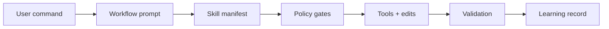
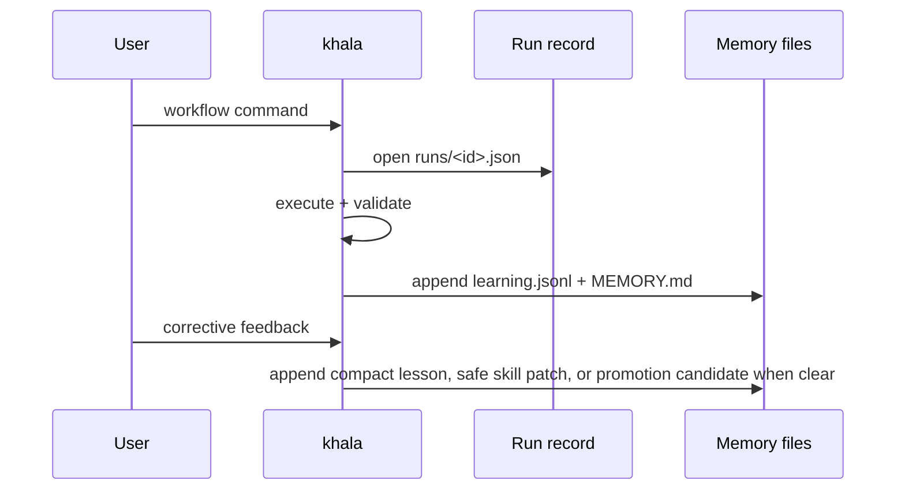

<div align="center">

# khala

**A guarded, self-learning Pi coding-agent runtime for pragmatic engineering work.**

<p>
  <a href="./LICENSE"></a>
  
  
</p>

</div>

---

## What khala adds

<table>
  <tr>
    <td><strong>Workflow commands</strong></td>
    <td>Debugging, review, simplification, planning, TDD, issue triage, shipping, and skill creation.</td>
  </tr>
  <tr>
    <td><strong>Safety gates</strong></td>
    <td>Risk approval, preflight/postflight evidence, blocked destructive commands, response compliance, and anti-stall turn obligations.</td>
  </tr>
  <tr>
    <td><strong>Local-first learning</strong></td>
    <td>File-backed workflow observations and corrective lessons with quality gates; no model fine-tuning or transcript storage.</td>
  </tr>
  <tr>
    <td><strong>Bundled tooling</strong></td>
    <td>Pi extensions for fast search (<code>@ff-labs/pi-fff</code>) and subagent workflows (<code>pi-subagents</code>).</td>
  </tr>
</table>

> [!IMPORTANT]
> khala favors minimal, reversible changes. High-risk operations require explicit checker approval.

## Quick start

```bash
pi install https://github.com/pesap/agents
pi
```

Inside Pi:

```text
/khala
```

Run once without installing:

```bash
pi -e https://github.com/pesap/agents -p "/khala"
```

## Core flow



## Commands

### Agent and policy control

| Command | Purpose |
| --- | --- |
| `/khala` | Initialize khala and set compliance mode to `warn` for the session. |
| `/khala status\|strict\|enforce\|warn\|monitor\|reset` | Report or change compliance mode. |
| `/end-agent` | Disable khala session context injection. |
| `/approve-risk <reason> [--ttl MINUTES]` | Approve one high-risk command. TTL defaults to 20 minutes and is capped to 1–120 minutes. |
| `/preflight Preflight: skill=<name\|none> reason="<short>" clarify=<yes\|no>` | Record manual mutation intent. |
| `/postflight Postflight: verify="<command_or_check>" result=<pass\|fail\|not-run>` | Record verification evidence. |
| `/skill-status <name>` | Show learned skill provenance and lifecycle state. |
| `/skill-report` | Regenerate the learned skill curator report from file-backed metadata. |
| `/pin-skill <name> [on\|off]` | Pin or unpin a learned skill. |
| `/archive-skill <name>` | Archive a learned skill without deleting it. |
| `/restore-skill <name>` | Restore an archived learned skill. |
| `/khala-reload` | Reload Pi resources so learned skills and workflow prompts become slash commands. |
| `/workflow-list` | List reviewed khala learned workflows. |
| `/workflow-show <name>` | Show a learned workflow artifact and its generated prompt template. |
| `/workflow-run <name> [input]` | Run a learned workflow by sending it to the agent with optional input. |
| `/rule-list [--all]` | List active khala runtime rules. |
| `/rule-show <id>` | Show a runtime rule and its structured metadata. |
| `/rule-promote <candidate-id> [--enforce\|--warn\|--advisory]` | Promote a candidate rule to active. |
| `/rule-session <trigger> => <instruction>` | Add a per-session runtime rule that expires on session shutdown. |
| `/rule-replace <id> key=value [...]` | Append a replacement record for a runtime rule. |
| `/rule-disable <id> <reason>` | Disable a runtime rule. |
| `/rule-audit [--limit N]` | Show recent rule promotion, disable, reload, hit, warn, and block events. |
| `/rule-reload` | Parse user edits from `rules/RULES.md` and append valid replacements. |

### Rules, simplified

There are three rule layers:

1. **Packaged defaults** — always-on rules shipped in `runtime/RULES.md`.
2. **Persistent user/repo rules** — editable rules stored in `.pi/khala/rules/RULES.md` (or `~/.pi/khala/rules/RULES.md` when no repo-local `.pi/` exists). After editing that file, run `/rule-reload`.
3. **Session-only rules** — temporary rules added with `/rule-session <trigger> => <instruction>`.

Use `runtime/RULES.md` when changing the default behavior that ships with khala. Use `.pi/khala/rules/RULES.md` for local or repo-specific persistent rules. Use `/rule-session` for temporary guidance.

### Workflow commands

These are registered and enabled by default unless `runtime/profile.yaml` disables them or their prompt/spec files fail validation.

| Command | Purpose |
| --- | --- |
| `/debug <problem> [--fix]` | Investigate a failure and optionally apply the smallest safe fix. |
| `/feature <request> [--ship]` | Deliver a scoped feature with tests/docs planning. |
| `/review [scope] [--extra "focus"]` | Review changes by scope: uncommitted, branch, commit, PR, folder, file, or paths. |
| `/git-review` | Run git-history diagnostics before reading code. |
| `/simplify [scope] [--extra "focus"]` | Behavior-preserving simplification and slop cleanup. |
| `/ship [extra instruction]` | Simplify, validate, commit, push, and open/confirm PR/MR. Uses GitButler target selection. |
| `/plan <plan_or_topic>` | Stress-test a plan and capture terms/ADRs when needed. |
| `/audit <claim>` | Run a full anti-confirmation-bias claim audit and revise confidence from evidence. |
| `/triage-issue <problem_statement>` | Investigate a bug and prepare a TDD fix plan/PR. |
| `/tdd <goal> [--lang auto\|python\|rust\|c]` | Run strict red-green-refactor delivery. |
| `/address-open-issues [--limit N] [--repo owner/repo]` | Sweep open GitHub issues authored by the current user. |
| `/learn-skill <topic> [--from <path\|url>] [--dry-run]` | Create or refine a reusable skill in the learning store. |

<details>
<summary><strong>Run workflows outside the REPL</strong></summary>

```bash
pi -e https://github.com/pesap/agents -p "/review README.md --extra 'focus on correctness'"
pi -e https://github.com/pesap/agents -p "/review https://github.com/owner/repo/pull/123"
pi -e https://github.com/pesap/agents -p "/simplify src/commands/review.ts"
pi -e https://github.com/pesap/agents -p "/ship"
pi -e https://github.com/pesap/agents -p "/tdd 'Add retry policy for hook loading' --lang rust"
```

</details>

## Runtime behavior

When khala is enabled (`/khala` or any khala workflow command):

<ul>
  <li><code>bash</code> calls are policy-checked.</li>
  <li>On Windows, khala can override <code>bash</code> to execute via PowerShell when the parent shell is PowerShell.</li>
  <li>Set <code>KHALA_FORCE_POWERSHELL_BASH=true|false</code> to force or disable this override, and <code>KHALA_POWERSHELL_PATH</code> to pin a specific executable.</li>
  <li>Risky/destructive commands may be blocked unless approved.</li>
  <li>Direct Python package/runtime commands are steered to <code>uv</code>.</li>
  <li>Workflow commands create auto-preflight records.</li>
  <li>Mutation workflows are checked for postflight evidence.</li>
  <li>Selected active runtime rules are injected as <code>[ACTIVE RUNTIME RULES]</code> before agent start.</li>
  <li>Concrete tool-work requests must be satisfied with a relevant tool call or a real blocking clarification; generic permission questions such as “Should I proceed?” do not satisfy the turn.</li>
  <li>Final workflow responses are checked for <code>Bias Check (Tier 1)</code> plus <code>Result: success|partial|failed</code> and <code>Confidence: &lt;0..1&gt;</code> when response compliance is enabled.</li>
</ul>

Blocked/steered command families include `pip`, `pip3`, `poetry`, `python -m pip`, `python -m venv`, `python -m py_compile`, and path-qualified Python executables. Intercepted `python`/`python3` route through `uv run`.

> [!NOTE]
> Local version-control write operations are expected to use GitButler (`but`). Workflows start from `but status -fv` and run `but setup --status-after` when setup is missing.

## Configuration and package layout

```text
.
├── commands/      # user-facing workflow prompts
├── workflows/     # workflow specs queued into Pi messages
├── skills/        # packaged reusable skills
├── extensions/    # Pi extension implementation
├── runtime/       # profile, compliance, hooks, and bootstrap docs
└── scripts/       # lightweight guard/regression checks
```

### Runtime config

| Path | Purpose |
| --- | --- |
| `runtime/profile.yaml` | Workflow enablement, prompt/spec names, low-confidence threshold, and first-principles defaults. |
| `runtime/compliance/first-principles-gate.yaml` | Persistent compliance gate defaults. |
| `runtime/hooks/hooks.yaml` | Lifecycle hook configuration. Hook markdown paths are constrained to `runtime/hooks/`. |
| `runtime/hooks/bootstrap.md` / `runtime/hooks/teardown.md` | Default session start/end hook docs. |

### Workflow prompts and specs

Workflow prompt frontmatter can list `skills:`. By default, khala injects a skill manifest only: skill name, description, and `skills/<name>/SKILL.md` path. Full skill bodies are injected only when a prompt/spec sets `skillContext: full`; `skillContext: none` disables skill context. Missing required skills stop the workflow before it is queued.

### Skills and learned skills

Package-registered skills come from `package.json` Pi config:

- `./skills`
- `./node_modules/pi-subagents/skills`

Packaged skills include `librarian`, copied from `https://github.com/mitsuhiko/agent-stuff/tree/main/skills/librarian`. When a prompt includes a GitHub repo URL or `owner/repo` shorthand, khala should load `librarian` and cache the repo before inspecting it.

`/learn-skill` writes learning artifacts to the khala learning store, not to package `skills/`, and does not automatically add them to package manifests or workflow skill frontmatter.

Khala names learned skills with a `khala-` prefix so they do not collide with packaged/global Pi skills. For source-backed additions (`--from`, `--from-file`, `--from-url`), khala reuses that stable companion-skill name instead of creating one new skill per source URL. This follows Pi skill best practice better: keep the reusable capability under one unique skill name and put source-specific material in that skill's support files instead of proliferating colliding sibling skills.

When end-of-turn assessment finds a high-confidence, non-sensitive promotable lesson, khala can create a background-authored learned skill in the khala learning store. If the lesson applies to a loaded background-authored skill, khala patches that skill instead. User-authored/imported skills are never edited directly; khala records a review/promotion queue item for them.

Khala exposes learned skills to Pi through `resources_discover`, so after `/khala-reload` they are available as normal Pi skills and can be invoked with `/skill:<name>` when skill commands are enabled.

### Memory tools

Khala also registers model-facing tools:

| Tool | Purpose |
| --- | --- |
| `khala_read_memory` | Read recent memory tail, active lessons, active runtime rules, and recent structured learnings. |
| `khala_search_memory` | Search older memory, runtime rules, learned skills, prompt templates, and workflow artifacts by relevance. |
| `khala_assess_learning` | Score whether a task produced a durable, non-sensitive lesson. |
| `khala_learn` | Persist a structured learning record. |

`khala_read_memory` is recency-based. `khala_search_memory` is relevance-based and accepts a task-specific `query`, optional `limit`, and optional `snippetLength`.

Learning persistence is conservative. A candidate must have a concrete trigger, a specific operating lesson, enough evidence, no sensitive material, and score/confidence at or above the storage threshold. Promotion requires higher score/confidence and repeated workflow success only creates a review candidate; it no longer creates runnable workflow artifacts automatically.

## Learning model

Learning is event-based memory, not model fine-tuning.



Durable artifacts are written to:

- Preferred: `<repo>/.pi/khala/` when `.pi/` exists in cwd
- Fallback: `~/.pi/khala/`

| File | Purpose |
| --- | --- |
| `memory/learning.jsonl` | Structured observations per workflow run. |
| `memory/lessons.jsonl` | Passive lessons inferred from corrective normal prompts. |
| `memory/MEMORY.md` | Concise chronological learnings. |
| `memory/promotion-queue.md` | Promotion/improvement candidates from repeated outcomes; review before creating reusable workflows. |
| `memory/skill-curator-report.md` | Post-workflow learned-skill review notes and patch recommendations. |
| `rules/active.jsonl` | Durable active runtime rules with replacement records. |
| `rules/session.jsonl` | Per-session active runtime rules, cleared on session shutdown. |
| `rules/candidates.jsonl` | Proposed rules that are not yet active. |
| `rules/audit.jsonl` | Runtime rule hit/warn/block/reload audit events. |
| `rules/RULES.md` | User-editable persistent rule file; edit it, then run `/rule-reload`. |
| `runs/*.json` | Per-run workflow records. |
| `workflows/*.yaml` | Reviewed reusable workflow artifacts. |
| `prompts/*.md` | Pi prompt templates for reviewed workflows. Run `/khala-reload` to expose them as slash commands. |
| `skills/<name>/SKILL.md` | Main learned skill instructions. |
| `skills/<name>/metadata.json` | Learned skill provenance and lifecycle metadata. |
| `skills/<name>/{references,templates,scripts}/` | Optional learned skill support assets. |
| `archive/skills/<name>/` | Recoverable archive path for archived learned skills. |

<details>
<summary><strong>What is enforced vs not enforced</strong></summary>

**Enforced** in configurable warn/enforce modes:

- preflight before mutation tools (`edit`, `write`, mutating `bash`)
- postflight evidence after mutation
- workflow response footer lines: `Result: ...` and `Confidence: 0..1`
- runtime checks for promise-only tool work, generic permission-question stalls, incomplete memory-gate recovery, and approval-required destructive requests
- learning quality gates before storage or promotion

**Not automatic:**

- no automatic edits to `README.md`, `INSTRUCTIONS.md`, or user-authored/imported skills from learning
- no automatic hot-reload after background learning; run `/khala-reload` to refresh Pi resources
- no automatic runnable workflow creation from repeated success statistics; repeated outcomes create review candidates
- no model training/fine-tuning
- no raw transcript or full tool-output storage for passive normal-chat learning

</details>

## Compliance modes

```text
/khala enforce   # strict mode
/khala warn      # warnings only
/khala reset     # configured defaults
```

Persistent defaults live in `runtime/compliance/first-principles-gate.yaml`.

Expected strict behavior:

- Missing preflight before first mutation (`edit`/`write`/mutating `bash`) → mutation is blocked with remediation text.
- Missing postflight evidence after mutation → workflow is marked failed at completion.
- Missing final `Result:` / `Confidence:` lines in workflow output → response is blocked until fixed.

## Design goals

1. One canonical agent identity.
2. Learn from user feedback and workflow outcomes.
3. Stay concise/token-efficient by default.
4. Prefer transparent file-backed learning (`learning.jsonl`, `lessons.jsonl`, `MEMORY.md`).
5. Enable safe self-improvement with explicit guardrails.
6. Keep memory fresh during long or mutating tasks by requiring `khala_read_memory` before mutation and after stale-memory thresholds.
