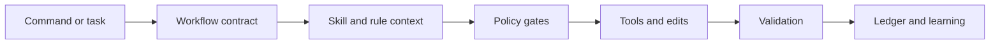

<div align="center">

# khala

**A guarded, self-learning Pi coding-agent runtime for serious engineering work.**

<p>
  <a href="https://github.com/pesap/agents/blob/main/LICENSE.txt"></a>
  
  
  
</p>

</div>

Khala turns Pi into a more deliberate maintainer agent: it adds workflow commands,
runtime safety gates, durable run ledgers, skill-aware routing, and conservative
file-backed learning. It is designed for local-first development, long-running
maintenance work, and recoverable agent sessions.

## Quick Start

Install Khala as a Pi package:

```bash
pi install https://github.com/pesap/agents.git
```

Start a session:

```text
/khala
```

Run without installing:

```bash
pi -e https://github.com/pesap/agents.git -p "/khala status"
```

Useful first checks:

```text
/khala status
/inbox
/run-list active
```

## What Khala Adds

| Area | What it gives you |
| --- | --- |
| Workflow commands | Debug, triage, planning, workon, review, simplify, ship, inbox, audit, and skill creation flows. |
| Safety gates | Risk approval, mutation preflight, postflight evidence, destructive-command blocking, response checks, and anti-stall rules. |
| Durable recovery | Global run ledgers with checkpoints, unsafe-event classification, and conservative resume prompts. |
| Learning | File-backed lessons, runtime rules, learned skills, and reusable workflow artifacts. |
| Tooling | Bundled fast search via `@ff-labs/pi-fff` and subagent support via `pi-subagents`. |

> [!IMPORTANT]
> Khala favors small, reversible changes. Risky operations require explicit
> approval or a clear operator checkpoint before they can be treated as safe.

## Core Loop



## Commands

### Workflow Commands

| Command | Purpose |
| --- | --- |
| `/debug <problem>` | Investigate an unreported maintainer-observed symptom and draft an issue-ready brief. |
| `/triage <issue-url\|request>` | Convert rough issue/request text into a `/workon`-ready packet. |
| `/plan <topic>` | Turn a maintainer idea into scoped work with risks, slices, acceptance criteria, and an internal Reviewer Two pass. |
| `/workon <issue-url\|issue-number>` | Start autonomous implementation from a ready issue packet. |
| `/review [scope]` | Review uncommitted changes, branches, commits, PRs, files, folders, or paths. |
| `/git-review` | Inspect git-history signals before reading implementation code. |
| `/simplify [scope]` | Perform behavior-preserving cleanup and slop removal. |
| `/ship [instruction]` | Validate, commit, push, and open or confirm a PR/MR. |
| `/inbox [flags]` | Show a read-only maintainer dashboard from local, forge, and session signals. |
| `/audit <claim>` | Run an anti-confirmation-bias audit against a claim or plan. |
| `/address-open-issues [flags]` | Sweep your open issues through triage, workon, review, and remediation. |
| `/learn-skill <topic>` | Create or refine a reusable skill in the learning store. |

Common `/workon` flags:

```text
--repo owner/repo
--forge auto|github|gitlab|all
--dry-run
--heartbeat HOURS
```

Common `/plan` flags:

```text
--review-model provider/model
--review-thinking off|minimal|low|medium|high|xhigh
--review-loops 1|2
--no-review
```

Use `/inbox` from a non-repository directory for a global side-terminal
dashboard. Inside a repository it defaults to repo scope; pass `--global` or
`--scope global` for the global view.

## Model Selection

Pi has two independent model-configuration scopes:

### Pi session model

Flags and commands that affect the **current interactive Pi session**:

```bash
pi --model provider/model --thinking high
```
or at runtime:
```text
/model provider/model
```

These change the model used for your current conversation. They do **not** affect
Khala-launched workflow sessions.

### Khala workflow model routing

Flags and config that affect **Khala workflow launches** (child Pi sessions spawned
by `/workon`, `/plan`, `/triage`, etc.):

```bash
pi --khala-workflow-profile development --khala-workflow-task workon
```

- `--khala-workflow-profile <name>` — override the profile used for all spawned
  workflow sessions (e.g. `development`, `planning`).
- `--khala-workflow-task <task>` — resolve a workflow route by task name
  (e.g. `workon` -> `development`, `plan` -> `planning`).

These flags are read at session start and stored for the lifetime of the session.
They never change the current Pi session model.

#### Durable workflow model config

Instead of passing flags each time, create `~/.pi/khala/workflow-model.yaml`:

```yaml
profiles:
  planning: "github-copilot/gpt-5.5:xhigh"
  development: "github-copilot/gpt-5.4-mini:medium"
  review: "github-copilot/gpt-5.5:high"

routes:
  plan: "planning"
  debug: "planning"
  triage: "planning"
  workon: "development"
  review: "review"
```

Profiles are keyed by name with `"provider/model:thinking"` format. Routes map
workflow task names to profile names. Builtin defaults remain as fallback for any
key not present in the config file.

#### Precedence

```text
explicit workflow override > --khala-workflow-* flag >
  route config > profile config > builtin default
```

When no flags or config are provided, Khala uses builtin defaults:

| Task | Resolved profile | Model | Thinking |
| --- | --- | --- | --- |
| `/workon` | development | `github-copilot/gpt-5.4-mini` (Pi-discovered) | `medium` |
| `/plan`, `/triage`, `/debug` | planning | `github-copilot/gpt-5.5` | `xhigh` |
| `/review`, `/audit` | development | `github-copilot/gpt-5.4-mini` (Pi-discovered) | `medium` |

> **Pi native flags vs Khala flags**: `pi --model` changes your current session.
> `--khala-workflow-*` flags configure Khala workflow launches. They are
> independent — you can use both at once without conflict.

### Run Ledger Commands

Khala records durable workflow runs under `~/.pi/khala/runs/`.

| Command | Purpose |
| --- | --- |
| `/run-list [filter]` | List durable runs. Useful filters include `active`, `resumable`, and `needs_operator_review`. |
| `/run-show <run-id\|path>` | Show workflow state, recent events, skill activity, checkpoints, and recovery classification. |
| `/run-resume <run-id\|path>` | Queue a resume prompt only when the ledger is classified as safe to resume. |
| `/run-checkpoint <run-id\|path> [reason]` | Record an operator-verified safe checkpoint. |

Resume is intentionally conservative. Unknown, shell, mutation, forge, external,
or metadata-less mutation events after the latest checkpoint require operator
review before Khala will resume automatically.
Run `/khala-health` to inspect profile resolution. `/khala status` remains a
compatibility alias that returns the same read-only health output in a
`:checkhealth`-style diagnostic format. The health output includes:

- **Session** section: enabled status, memory tool limit, compliance modes.
- **Pi session model** section: current interactive Pi model and thinking level.
- **Khala workflow model routing** section: active `--khala-workflow-*` flags.
- **Model profiles** section: per-profile `OK`/`WARNING`/`ERROR` status with
  resolved model, thinking level, used-by routes, problems, and fix steps.

If the development profile is unresolved, `/workon` refuses to emit handoff
evidence and points operators back to `/khala-health` instead of silently
falling back to the planning model.

### Policy Commands

| Command | Purpose |
|---|---|
| `/khala` | Initialize khala and set compliance to `warn`. |
| `/khala-health` | Report read-only Khala health/status in `:checkhealth`-style format, including session enablement, memory tool limit, compliance modes, Pi session model, workflow routing flags, and model profiles. `/khala status` is a compatibility alias. |
| `/khala-mode status\|strict\|enforce\|warn\|warning\|monitor\|reset\|default\|defaults` | Report or change compliance mode. `status` matches `/khala-health` while the other values change compliance; `default` and `defaults` restore the first-principles defaults. |
| `/end-agent` | Disable khala session context injection. |
| `/approve-risk <reason> [--ttl MINUTES]` | Approve one high-risk command (TTL 1–120 min, default 20). |
| `/preflight Preflight: skill=<name\|none> reason="<short>" clarify=<yes\|no>` | Record manual mutation intent. |
| `/postflight Postflight: verify="<command>" result=<pass\|fail\|not-run>` | Record verification evidence. |

### Learning, Skills, and Rules

| Command | Purpose |
| --- | --- |
| `/skill-status <name>` | Show learned skill provenance and lifecycle state. |
| `/skill-report` | Regenerate the learned skill curator report. |
| `/pin-skill <name> [on\|off]` | Pin or unpin a learned skill. |
| `/archive-skill <name>` | Archive a learned skill without deleting it. |
| `/restore-skill <name>` | Restore an archived learned skill. |
| `/khala-reload` | Reload learned skills and workflow prompts into Pi. |
| `/workflow-list` | List reviewed learned workflows. |
| `/workflow-show <name>` | Show a learned workflow artifact and prompt template. |
| `/workflow-run <name> [input]` | Run a learned workflow. |
| `/rule-list [--all]` | List active runtime rules. |
| `/rule-add <trigger> => <instruction>` | Add a durable runtime rule. |
| `/rule-session <trigger> => <instruction>` | Add a temporary session-only rule. |
| `/rule-promote <candidate-id>` | Promote a candidate rule. |
| `/rule-replace <id> key=value [...]` | Replace a rule by appending a new record. |
| `/rule-disable <id> <reason>` | Disable a rule. |
| `/rule-audit [--limit N]` | Show recent rule activity. |
| `/rule-reload` | Reload hand-edited `rules/RULES.md` from the learning store. |

Rule examples:

```text
/rule-add mutation work => Search task-specific memory before editing files. --warn
/rule-add destructive commands => Ask before destructive filesystem or git operations. --enforce
/rule-session current debug task => Prefer root-cause evidence before fixes. --advisory
```

## Model Profiles

Khala routes workflows through named model profiles instead of scattering model
choices through prompts. Profiles are configured via the durable workflow model
config (`~/.pi/khala/workflow-model.yaml`) or builtin defaults.

| Profile | Default | Thinking | Used by |
| --- | --- | --- | --- |
| `planning` | `github-copilot/gpt-5.5` | `xhigh` | `/plan`, `/triage`, `/debug` |
| `development` (`agents`) | Pi-discovered `github-copilot/gpt-5.4-mini` | `medium` | `/workon`, `/review`, `/audit` |
| `review` | (custom, config-only) | configurable | `/review` (if configured) |

Run `/khala-health` to see whether profiles resolve in the current Pi
environment, with `OK`/`WARNING`/`ERROR` status per profile, used-by routes,
problem details, and fix steps. If the development profile is unavailable,
`/workon` stops before handoff and tells you how to override or configure the
model via `~/.pi/khala/workflow-model.yaml` or `--khala-workflow-*` flags.

## Runtime Behavior

When Khala is active, it adds guardrails around normal agent work:

- Mutation tools require fresh task context and preflight evidence.
- Workflows require postflight evidence and a structured final footer.
- Destructive commands are blocked unless approved.
- Empty responses, promise-only replies, repeated tool failures, duplicate
  evidence calls, and incomplete memory-gate recoveries are flagged.
- Explicit or claimed skill use must be backed by actual skill loading or
  delegated skill output.
- Workflow runs write durable events, checkpoints, completion summaries, and
  recovery classifications.
- Learning is accepted only when it is concrete, reusable, non-sensitive, and
  above quality thresholds.

Persistent defaults live in:

```text
runtime/profile.yaml
runtime/compliance/first-principles-gate.yaml
runtime/hooks/hooks.yaml
```

## Storage

Khala keeps package code and mutable state separate.

| Location | Purpose |
| --- | --- |
| `runtime/` | Packaged defaults, compliance config, hook docs, and bootstrap instructions. |
| `commands/` | User-facing workflow prompts. |
| `workflows/` | Workflow specs queued into Pi messages. |
| `skills/` | Packaged reusable skills. |
| `extensions/` | Pi extension implementation. |
| `scripts/` | Lightweight guard and regression checks. |
| `~/.pi/khala/` | Mutable Khala state: memory, learned skills, rules, run ledgers, and runtime logs. |

The repository intentionally ignores `.pi/`. Project-local Pi settings and
runtime artifacts are local state, not source code.

Important mutable files under `~/.pi/khala/`:

| File | Purpose |
| --- | --- |
| `runs/*.json` | Durable workflow run ledgers with events, checkpoints, resume attempts, and completion metadata. |
| `memory/learning.jsonl` | Structured workflow observations. |
| `memory/lessons.jsonl` | Passive lessons from corrective prompts. |
| `memory/MEMORY.md` | Compact chronological memory. |
| `memory/promotion-queue.md` | Candidate improvements from repeated outcomes. |
| `memory/skill-curator-report.md` | Learned-skill review notes. |
| `rules/active.jsonl` | Durable active runtime rules. |
| `rules/session.jsonl` | Session-only rules, cleared on shutdown. |
| `rules/candidates.jsonl` | Proposed rules waiting for promotion. |
| `rules/audit.jsonl` | Rule hit, warn, block, reload, and promotion events. |
| `rules/RULES.md` | Human-readable durable rule mirror. |
| `runtime/live/dailylog.md` | Hook teardown summaries and runtime notes. |

## Memory Tools

Khala exposes four tools to the model:

| Tool | Purpose |
| --- | --- |
| `khala_read_memory` | Read current task memory, active rules, recent learnings, and context snippets. |
| `khala_search_memory` | Search older memory, rules, learned skills, prompt templates, and workflow artifacts. |
| `khala_assess_learning` | Score whether a lesson is worth storing. |
| `khala_learn` | Persist a structured learning record after quality checks. |

## Development

Install dependencies:

```bash
npm install
```

Run the main checks:

```bash
npm run smoke
```

Run the Pi integration smoke:

```bash
npm run test:pi
```

Use an editable local install while developing:

```bash
pi install -l .
pi -p "/khala status"
```

If a global URL install is also enabled, remove it to avoid duplicate extension
registration:

```bash
pi remove https://github.com/pesap/agents.git
```

## Design Goals

1. Keep one canonical agent identity.
2. Make long-running work resumable and auditable.
3. Prefer small, reversible, evidence-backed changes.
4. Store learning in transparent local files, not model weights.
5. Keep startup context compact and retrieve task-specific memory on demand.
6. Let the harness improve without hiding state from the maintainer.

## Further Reading

- [`docs/maintainer-os-north-star.md`](docs/maintainer-os-north-star.md)
- [`runtime/RULES.md`](runtime/RULES.md)
- [`runtime/INSTRUCTIONS.md`](runtime/INSTRUCTIONS.md)
