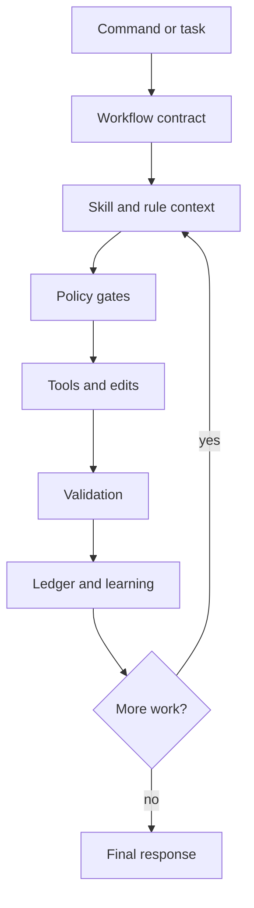

<div align="center">

# khala

**A guarded, self-learning Pi coding-agent runtime for serious engineering
work.**

<p>
  <a href="https://github.com/pesap/khala/actions/workflows/ci.yml"></a>
  <a href="LICENSE"></a>
  
  
  
  
</p>

<p>
  <a href="#quickstart">Quickstart</a> ·
  <a href="#install">Install</a> ·
  <a href="#commands">Commands</a> ·
  <a href="#concepts">Concepts</a> ·
  <a href="#development">Development</a> ·
  <a href="#docs">Docs</a>
</p>

</div>

Khala turns Pi into a more deliberate maintainer agent. It adds workflow
commands, runtime safety gates, durable run ledgers, skill-aware routing, and
conservative file-backed learning for local-first development and recoverable
agent sessions.

> [!NOTE] Khala is currently source-first. The setup helper runs from a GitHub
> package ref; a published npm package is not required.

---

## Quickstart

Run the setup helper directly from GitHub:

```bash
npm exec --yes --package "github:pesap/khala#main" -- khala
```

The helper asks where to install Khala and which workflow models to write. Then
start Pi and verify the extension:

```text
/khala-health
```

For LiteLLM-compatible provider setup, start with the dedicated guide:
[docs/litellm-setup.md](docs/litellm-setup.md).

---

## Install

| Path               | Command                                                          |
| ------------------ | ---------------------------------------------------------------- |
| Setup helper       | `npm exec --yes --package "github:pesap/khala#main" -- khala`    |
| `npx` alias        | `npx --yes github:pesap/khala`                                   |
| Global Pi install  | `pi install https://github.com/pesap/khala`                      |
| Project Pi install | `pi install -l https://github.com/pesap/khala`                   |
| Current checkout   | `pi --no-extensions -e ./extensions/index.ts -p "/khala-health"` |

> [!TIP] Use a project install when a repository needs its own
> `.pi/settings.json` and workflow model routing. Use a global install for your
> default maintainer setup.

---

## Commands

| Command                                | What it does                                                               |
| -------------------------------------- | -------------------------------------------------------------------------- |
| `/khala-health`                        | Reports extension status, compliance modes, and workflow model profiles    |
| `/workon <issue>`                      | Starts autonomous implementation from a ready issue packet                 |
| `/plan <topic>`                        | Turns an idea into scoped work with risks and acceptance criteria          |
| `/debug <problem>`                     | Investigates a maintainer-observed symptom and drafts an issue-ready brief |
| `/review [scope]`                      | Reviews changes, branches, commits, PRs, files, or folders                 |
| `/inbox [flags]`                       | Shows a read-only maintainer dashboard                                     |
| `/run-list [filter]`                   | Lists durable workflow runs                                                |
| `/rule-add <trigger> => <instruction>` | Adds a durable runtime rule                                                |

See [docs/commands.md](docs/commands.md) for the full command reference,
preflight format, run ledger commands, and learning/rule management.

---

## Concepts

| Area              | What Khala adds                                                                                           |
| ----------------- | --------------------------------------------------------------------------------------------------------- |
| Workflow commands | Debug, triage, planning, workon, review, simplify, ship, inbox, audit, and skill creation flows           |
| Safety gates      | Risk approval, mutation preflight, postflight evidence, destructive-command blocking, and response checks |
| Durable recovery  | Global run ledgers with checkpoints, unsafe-event classification, and conservative resume prompts         |
| Learning          | File-backed lessons, runtime rules, learned skills, and reusable workflow artifacts                       |
| Tooling           | Fast search via `@ff-labs/pi-fff` and subagent support via `pi-subagents`                                 |



> [!IMPORTANT] Khala favors small, reversible changes. Risky operations require
> explicit approval or a clear operator checkpoint before they can be treated as
> safe.

---

## Development

```bash
npm install
npm run smoke
```

Use the checkout directly while developing:

```bash
pi --no-extensions -e ./extensions/index.ts -p "/khala-health"
```

More development, benchmark, and Pi integration details live in
[docs/development.md](docs/development.md).

---

## Docs

| Topic                        | Start here                                                             |
| ---------------------------- | ---------------------------------------------------------------------- |
| LiteLLM and provider setup   | [docs/litellm-setup.md](docs/litellm-setup.md)                         |
| Commands and policy gates    | [docs/commands.md](docs/commands.md)                                   |
| Workflow model routing       | [docs/workflow-model-routing.md](docs/workflow-model-routing.md)       |
| Runtime, storage, and memory | [docs/runtime-reference.md](docs/runtime-reference.md)                 |
| Harness benchmarks           | [docs/harness-benchmark-sandbox.md](docs/harness-benchmark-sandbox.md) |
| Product direction            | [docs/maintainer-os-north-star.md](docs/maintainer-os-north-star.md)   |

## License

MIT. See [LICENSE](LICENSE).
