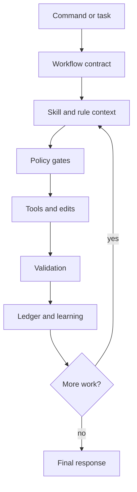

<div align="center">

# khala

**A guarded, self-learning Pi coding-agent runtime for serious engineering
work.**

<p>
  <a href="https://github.com/pesap/khala/blob/main/LICENSE"></a>
  
  
  
</p>

</div>

Khala turns Pi into a more deliberate maintainer agent: it adds workflow
commands, runtime safety gates, durable run ledgers, skill-aware routing, and
conservative file-backed learning. It is designed for local-first development,
long-running maintenance work, and recoverable agent sessions.

## Quick Start

Run the setup helper directly from GitHub with `npm exec`:

```bash
npm exec --yes --package "github:pesap/khala#main" -- khala
```

The equivalent `npx` form is:

```bash
npx --yes github:pesap/khala
```

The helper asks whether to install globally or into the current project, then
asks which workflow models to write into Khala's workflow config. After that it
reacts to the Pi state already on disk: it checks `pi --list-models` for model
availability, reads read-only `models.json` provider discovery from Pi's config
directory, and shows LiteLLM-compatible aliases when they already exist. Khala
does not prompt for raw API keys, call Pi `/login`, or manage a separate secret
store. This path does not require a local checkout or a published npm package.

For LiteLLM-compatible provider setup, use:

```bash
khala litellm --project \
  --provider team-litellm \
  --base-url https://lite.example/v1 \
  --key-env reeds-maint \
  --model gpt-5.4-mini
```

`--key-env` accepts a portal-style label (the same name you assigned the key
on your LiteLLM admin portal) so you can correlate Pi providers with portal
keys at a glance. Khala derives the shell-canonical env var name from it —
`reeds-maint` → `$REEDS_MAINT` — and tells you exactly what to `export` if you
choose env-var resolution. If you typed a valid identifier like
`LITELLM_API_KEY` directly, derivation is a no-op.

In interactive mode Khala asks how Pi should resolve the API key for this
provider. Three options match Pi's own `auth.json` schema, so the resulting
file is indistinguishable from one written by `/login`:

- **Paste the key value once** — stored at `~/.pi/agent/auth.json[<provider>].key`
  as a literal string. The file is created with `0600` permissions; the value is
  never echoed to stdout or stderr. Pi reads it directly at runtime; no shell
  env var needed.
- **Use a shell command** (e.g. `!op read 'op://Personal/team/credential'` or
  `!security find-generic-password -ws team`) — stored verbatim. Pi exec's the
  command on demand and uses stdout as the key. The actual secret stays in your
  password manager / keychain.
- **Skip** — nothing is written to `auth.json`. Pi falls back to reading the
  derived env var (e.g. `$REEDS_MAINT`) from the shell, matching the original
  behavior.

For scripting, the same modes are available as flags:
`--auth-mode={skip,literal,command}` with `--auth-key=<value>` or
`--auth-command='!cmd'`. Run `khala litellm --help` for the full surface.

In all three modes, `models.json` keeps a stable `!khala litellm print-key
--provider <id>` resolver entry, and each project records its own selected
key environment variable under `.pi/khala/litellm.json`. The picker also
fetches LiteLLM's `/model/info` endpoint when a key source is available, so
the selected models get rich metadata (context window, costs, reasoning,
input modalities) instead of bare `{ id }` entries.

Khala asks before changing `.pi/settings.json` in interactive runs. In scripts,
pass `--project-settings` only when you want the selected models to become this
project's Pi defaults.

If the package is already installed, run the helper directly:

```bash
khala
```

Or configure Pi directly:

```bash
pi install npm:khala              # writes ~/.pi/agent/settings.json
pi install -l npm:khala           # writes .pi/settings.json for this project
```

Start Pi and initialize Khala:

```text
/khala
/khala-health
```

Try the current checkout without installing:

```bash
pi --no-extensions -e ./extensions/index.ts -p "/khala-health"
```

## What Khala Adds

| Area              | What it gives you                                                                                                            |
| ----------------- | ---------------------------------------------------------------------------------------------------------------------------- |
| Workflow commands | Debug, triage, planning, workon, review, simplify, ship, inbox, audit, and skill creation flows.                             |
| Safety gates      | Risk approval, mutation preflight, postflight evidence, destructive-command blocking, response checks, and anti-stall rules. |
| Durable recovery  | Global run ledgers with checkpoints, unsafe-event classification, and conservative resume prompts.                           |
| Learning          | File-backed lessons, runtime rules, learned skills, and reusable workflow artifacts.                                         |
| Tooling           | Bundled fast search via `@ff-labs/pi-fff` and subagent support via `pi-subagents`.                                           |

> [!IMPORTANT] Khala favors small, reversible changes. Risky operations require
> explicit approval or a clear operator checkpoint before they can be treated as
> safe.

## Core Loop



## Commands

### Workflow Commands

| Command                             | Purpose                                                                                                             |
| ----------------------------------- | ------------------------------------------------------------------------------------------------------------------- |
| `/debug <problem>`                  | Investigate an unreported maintainer-observed symptom and draft an issue-ready brief.                               |
| `/triage <issue-url\|request>`      | Convert rough issue/request text into a `/workon`-ready packet.                                                     |
| `/plan <topic>`                     | Turn a maintainer idea into scoped work with risks, slices, acceptance criteria, and an internal Reviewer Two pass. |
| `/workon <issue-url\|issue-number>` | Start autonomous implementation from a ready issue packet.                                                          |
| `/review [scope]`                   | Review uncommitted changes, branches, commits, PRs, files, folders, or paths.                                       |
| `/git-review`                       | Inspect git-history signals before reading implementation code.                                                     |
| `/simplify [scope]`                 | Perform behavior-preserving cleanup and slop removal.                                                               |
| `/ship [instruction]`               | Validate, commit, push, and open or confirm a PR/MR.                                                                |
| `/inbox [flags]`                    | Show a read-only maintainer dashboard from local, forge, and session signals.                                       |
| `/audit <claim>`                    | Run an anti-confirmation-bias audit against a claim or plan.                                                        |
| `/address-open-issues [flags]`      | Sweep your open issues through triage, workon, review, and remediation.                                             |
| `/learn-skill <topic>`              | Create or refine a reusable skill in the learning store.                                                            |

Common `/workon` flags:

```text
--repo owner/repo
--forge auto|github|gitlab|all
--multiplexer auto|none|zellij|tmux
--dry-run
--heartbeat HOURS
--model provider/model
```

`/workon` uses a generic multiplexer handoff boundary. `auto` launches through
Zellij when `$ZELLIJ` is active, through tmux when `$TMUX` is active and Zellij
is not, and otherwise uses direct Worktrunk worktree creation. Use
`--multiplexer none` to force the direct Worktrunk path without Pi or heartbeat
pane/window launch.

Common `/plan` flags:

```text
--review-model provider/model
--review-thinking off|minimal|low|medium|high|xhigh
--review-loops 1|2
--no-review
```

Use `/inbox` from a non-repository directory for a global side-terminal
dashboard. Inside a repository it defaults to repo scope; pass `--global` or
`--scope global` for the global view.

Workflow model routing for `/workon`, `/plan`, and other child sessions is
configured through Khala workflow profiles, not command flags. See
[docs/workflow-model-routing.md](docs/workflow-model-routing.md) for flags,
durable YAML config, precedence, and builtin defaults.

Run `/khala-health` to inspect session configuration and Khala workflow model
profiles.

### Run Ledger Commands

Khala records durable workflow runs under `~/.pi/khala/runs/`.

| Command                                   | Purpose                                                                                       |
| ----------------------------------------- | --------------------------------------------------------------------------------------------- |
| `/run-list [filter]`                      | List durable runs. Useful filters include `active`, `resumable`, and `needs_operator_review`. |
| `/run-show <run-id\|path>`                | Show workflow state, recent events, skill activity, checkpoints, and recovery classification. |
| `/run-resume <run-id\|path>`              | Queue a resume prompt only when the ledger is classified as safe to resume.                   |
| `/run-checkpoint <run-id\|path> [reason]` | Record an operator-verified safe checkpoint.                                                  |

Resume is intentionally conservative. Unknown, shell, mutation, forge, external,
or metadata-less mutation events after the latest checkpoint require operator
review before Khala will resume automatically. Run `/khala-health` to inspect
profile resolution. The health output includes:

- **Session** section: enabled status, memory tool limit, compliance modes.
- **Model profiles** section: per-profile `OK`/`ERROR` status with resolved
  model, thinking level, used-by routes, problems, and fix steps.

If the development profile is unresolved, `/workon` refuses to emit handoff
evidence and points operators back to `/khala-health` instead of silently
falling back to the planning model.

### Policy Commands

<!-- markdownlint-disable MD013 MD060 -->

| Command                                                                       | Purpose                                                                                                                                       |
| ----------------------------------------------------------------------------- | --------------------------------------------------------------------------------------------------------------------------------------------- |
| `/khala`                                                                      | Initialize khala and set compliance to `warn`.                                                                                                |
| `/khala-health`                                                               | Report read-only Khala health/status, including session enablement, memory tool limit, compliance modes, workflow config, and model profiles. |
| `/khala-hub [--path <path\|git-ref> [--subdir <relative-path>]]`              | Report or set the Khala hub path for the LLM wiki. Default storage is `~/.pi/khala/hub/`.                                                     |
| `/khala-mode [enforce\|warn\|ignore]`                                         | With no arguments, report read-only status. With a mode argument, change all compliance modes.                                                |
| `/approve-risk <reason> [--ttl MINUTES]`                                      | Approve one high-risk command (TTL 1–120 min, default 20).                                                                                    |
| `/preflight Preflight: skill=<name\|none> reason="<short>" clarify=<yes\|no>` | Record manual mutation intent.                                                                                                                |
| `/postflight Postflight: verify="<command>" result=<pass\|fail\|not-run>`     | Record verification evidence.                                                                                                                 |

<!-- markdownlint-enable MD013 MD060 -->

### Learning, Skills, and Rules

| Command                                                 | Purpose                                                      |
| ------------------------------------------------------- | ------------------------------------------------------------ |
| `/skill-status <name>`                                  | Show learned skill provenance and lifecycle state.           |
| `/skill-report`                                         | Regenerate the learned skill curator report.                 |
| `/pin-skill <name> [on\|off]`                           | Pin or unpin a learned skill.                                |
| `/archive-skill <name>`                                 | Archive a learned skill without deleting it.                 |
| `/restore-skill <name>`                                 | Restore an archived learned skill.                           |
| `/khala-reload`                                         | Reload learned skills and workflow prompts into Pi.          |
| `/workflow-list`                                        | List reviewed learned workflows.                             |
| `/workflow-show <name>`                                 | Show a learned workflow artifact and prompt template.        |
| `/workflow-run <name> [--model provider/model] [input]` | Run a learned workflow with a durable run ledger.            |
| `/rule-list [--all]`                                    | List active runtime rules.                                   |
| `/rule-add <trigger> => <instruction>`                  | Add a durable runtime rule.                                  |
| `/rule-session <trigger> => <instruction>`              | Add a temporary session-only rule.                           |
| `/rule-promote <candidate-id>`                          | Promote a candidate rule.                                    |
| `/rule-replace <id> key=value [...]`                    | Replace a rule by appending a new record.                    |
| `/rule-disable <id> <reason>`                           | Disable a rule.                                              |
| `/rule-audit [--limit N]`                               | Show recent rule activity.                                   |
| `/rule-reload`                                          | Reload hand-edited `rules/RULES.md` from the learning store. |

Rule examples:

```text
/rule-add mutation work => Search task-specific memory before editing files. --warn
/rule-add destructive commands => Ask before destructive filesystem or git operations. --enforce
/rule-session current debug task => Prefer root-cause evidence before fixes. --advisory
```

## Model Profiles

Khala routes workflow child sessions through named model profiles. Profiles and
routes are configurable via `.pi/khala/workflow-model.yaml` for project installs
or `~/.pi/agent/khala/workflow-model.yaml` for global installs. Set
`PI_CODING_AGENT_DIR` if your global Pi config directory is elsewhere. See
[docs/workflow-model-routing.md](docs/workflow-model-routing.md) for details.

## Runtime Behavior

When Khala is active, it adds guardrails around normal agent work:

- Mutation tools require fresh task context and preflight evidence.
- Workflows require postflight evidence and a structured final footer.
- Destructive commands are blocked unless approved.
- Empty responses, promise-only replies, repeated tool failures, duplicate
  evidence calls, and incomplete memory-gate recoveries are flagged.
- Explicit or claimed skill use must be backed by actual skill loading or
  delegated skill output.
- Workflow runs write durable events, checkpoints, completion summaries, and
  recovery classifications.
- Learning is accepted only when it is concrete, reusable, non-sensitive, and
  above quality thresholds.

Persistent defaults live in:

```text
runtime/profile.yaml
runtime/compliance/first-principles-gate.yaml
runtime/hooks/hooks.yaml
```

## Storage

Khala keeps package code and mutable state separate.

| Location                    | Purpose                                                                            |
| --------------------------- | ---------------------------------------------------------------------------------- |
| `runtime/`                  | Packaged defaults, compliance config, hook docs, and bootstrap instructions.       |
| `commands/`                 | User-facing workflow prompts.                                                      |
| `workflows/`                | Workflow specs queued into Pi messages.                                            |
| `skills/`                   | Packaged reusable skills.                                                          |
| `extensions/`               | Pi extension implementation.                                                       |
| `scripts/`                  | Lightweight guard and regression checks.                                           |
| `~/.pi/agent/settings.json` | Global Pi package configuration; `pi install npm:khala` writes here.               |
| `.pi/settings.json`         | Project-local Pi package configuration; `pi install -l npm:khala` writes here.     |
| `.pi/khala/`                | Project-local Khala configuration files such as `workflow-model.yaml`.             |
| `~/.pi/agent/khala/`        | Global Khala configuration files such as `workflow-model.yaml`.                    |
| `~/.pi/khala/`              | Mutable Khala state: memory, learned skills, rules, run ledgers, and runtime logs. |

The repository intentionally ignores `.pi/`. Project-local Pi settings and
runtime artifacts are local state, not source code.

Important mutable files under `~/.pi/khala/`:

| File                             | Purpose                                                                                          |
| -------------------------------- | ------------------------------------------------------------------------------------------------ |
| `runs/*.json`                    | Durable workflow run ledgers with events, checkpoints, resume attempts, and completion metadata. |
| `memory/learning.jsonl`          | Structured workflow observations.                                                                |
| `memory/lessons.jsonl`           | Passive lessons from corrective prompts.                                                         |
| `memory/MEMORY.md`               | Compact chronological memory.                                                                    |
| `memory/promotion-queue.md`      | Candidate improvements from repeated outcomes.                                                   |
| `memory/skill-curator-report.md` | Learned-skill review notes.                                                                      |
| `rules/active.jsonl`             | Durable active runtime rules.                                                                    |
| `rules/session.jsonl`            | Session-only rules, cleared on shutdown.                                                         |
| `rules/candidates.jsonl`         | Proposed rules waiting for promotion.                                                            |
| `rules/audit.jsonl`              | Rule hit, warn, block, reload, and promotion events.                                             |
| `rules/RULES.md`                 | Human-readable durable rule mirror.                                                              |
| `runtime/live/dailylog.md`       | Hook teardown summaries and runtime notes.                                                       |

## Memory Tools

Khala exposes four tools to the model:

| Tool                    | Purpose                                                                               |
| ----------------------- | ------------------------------------------------------------------------------------- |
| `khala_read_memory`     | Read current task memory, active rules, recent learnings, and context snippets.       |
| `khala_search_memory`   | Search older memory, rules, learned skills, prompt templates, and workflow artifacts. |
| `khala_assess_learning` | Score whether a lesson is worth storing.                                              |
| `khala_learn`           | Persist a structured learning record after quality checks.                            |

## Development

Install dependencies:

```bash
npm install
```

Run the main checks:

```bash
npm run smoke
```

Run the Pi integration smoke:

```bash
npm run test:pi
```

Use the current checkout while developing:

```bash
pi --no-extensions -e ./extensions/index.ts -p "/khala-health"
```

If a global URL install is also enabled, remove it to avoid duplicate extension
registration:

```bash
pi remove https://github.com/pesap/khala.git
```

## Design Goals

1. Keep one canonical agent identity.
2. Make long-running work resumable and auditable.
3. Prefer small, reversible, evidence-backed changes.
4. Store learning in transparent local files, not model weights.
5. Keep startup context compact and retrieve task-specific memory on demand.
6. Let the harness improve without hiding state from the maintainer.

## Further Reading

- [`docs/maintainer-os-north-star.md`](docs/maintainer-os-north-star.md)
- [`runtime/RULES.md`](runtime/RULES.md)
- [`runtime/INSTRUCTIONS.md`](runtime/INSTRUCTIONS.md)
