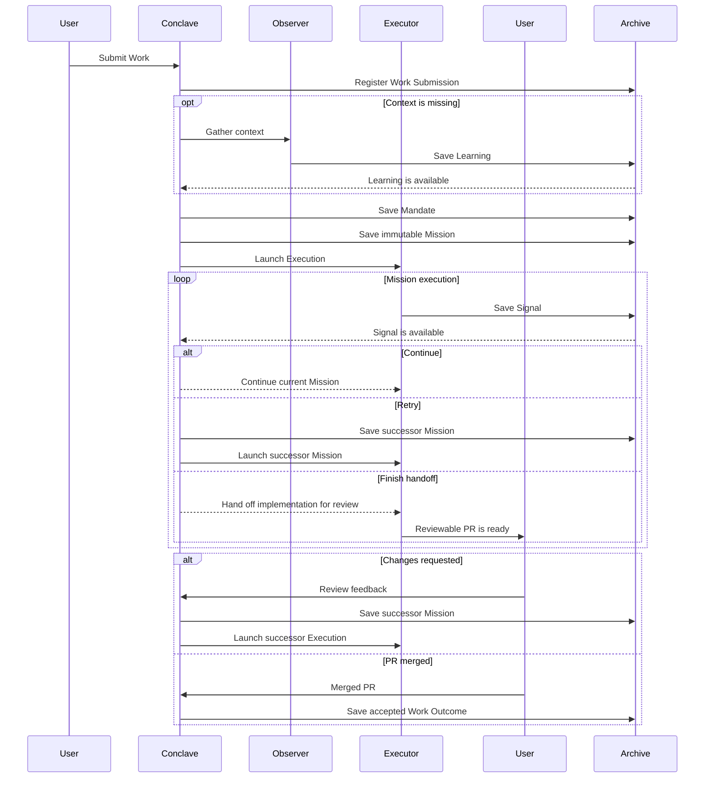

<div>


### khala
> Govern coding work with a Conclave, execute it in isolated sandboxes, and keep the evidence.
>
> [](https://github.com/pesap/khala)
> [](https://github.com/pesap/khala/actions/workflows/ci.yaml)
> [](https://github.com/pesap/khala/releases)
> [](LICENSE-MIT.txt)
> [](https://github.com/pesap/khala/commits/main)
<br/>
<br/>
<br/>

<p align="center">
  <a href="#why-khala">Why Khala</a> ·
  <a href="#features">Features</a> ·
  <a href="#pi-tools">Pi Tools</a> ·
  <a href="#quick-start">Quick Start</a> ·
  <a href="#documentation">Documentation</a> ·
  <a href="#development">Development</a>
</p>

Khala is a [Pi coding-agent](https://github.com/earendil-works/pi) extension for
coordinating serious repository work across specialized agent roles.

A user describes Work. A project-scoped Conclave validates it and decides
whether it is ready to execute. An isolated Executor performs the mission in
a Git worktree and reports evidence-bearing Signals. The Conclave reviews the
evidence and records a Verdict. When context is missing, a read-only Observer
gathers it first. Every durable transition is written to an append-only Archive.

> The principle: agents may act, but only evidence changes the record.

Khala is intentionally narrow. It does not replace your VCS, terminal
multiplexer, model provider, or project database. It composes those boundaries
and makes the lifecycle visible and recoverable.

## Why Khala

- Bounded roles. Users, the Conclave, Observers, and Executors have
  different authority and different tools.
- Isolated execution. Executors work in Git worktrees instead of the caller's
  checkout.
- Evidence before judgment. Signals carry summaries and concrete evidence;
  Verdicts must reference a Signal from the same execution.
- Durable coordination. The project Archive survives sessions, panes, and
  launcher failures.
- Recoverable lifecycle. Failed launches can return to the queue, and Retry
  creates a successor execution rather than rewriting history.
- Observable by default. The minimum Khala monitor shows the Conclave, headless
  Executors, Observer panes, states, Signals, sandboxes, supervision, and
  recovery facts.

## How it works

The user-facing lifecycle is short. The Archive keeps the detailed history
behind it; see the [detailed lifecycle](docs/lifecycle.md). Every Khala Work
publishes its Executor branch and creates a draft Pull Request before the
Executor can hand the implementation off for User review.


```mermaid
sequenceDiagram
    participant U as User
    participant C as Conclave
    participant O as Observer
    participant E as Executor
    participant H as User
    participant A as Archive

    U->>C: Submit Work
    C->>A: Register Work Submission

    opt Context is missing
        C->>O: Gather context
        O->>A: Save Learning
        A-->>C: Learning is available
    end

    C->>A: Save Mandate
    C->>A: Save immutable Mission
    C->>E: Launch Execution

    loop Mission execution
        E->>A: Save Signal
        A-->>C: Signal is available

        alt Continue
            C-->>E: Continue current Mission
        else Retry
            C->>A: Save successor Mission
            C->>E: Launch successor Mission
        else Finish handoff
            C-->>E: Hand off implementation for review
            E->>H: Reviewable PR is ready
        end
    end

    alt Changes requested
        H->>C: Review feedback
        C->>A: Save successor Mission
        C->>E: Launch successor Execution
    else PR merged
        H->>C: Merged PR
        C->>A: Save accepted Work Outcome
    end
```

The normal path is `Work Submission → Mandate → Mission → Execution →
Reviewable PR → Merged PR → Work Outcome`. Observer Learning, Preserver
Counsel, Continue, and Retry are side paths used when context, guidance, or
recovery requires them. A merged PR is acceptance; a merely closed PR is not.

The Archive is append-only. Current state is a projection of the latest record
for an entity; the complete history remains available for review and recovery.

## Features

- `/khala-work` loads the structured Work template.
- `/git-review [scope]` performs a read-only, history-first repository inspection and produces an evidence-backed code-reading plan.
- `/khala-triage` (also `/triage`) turns an issue into a WorkPacket, resolves uncertainty interactively, and sends approved Work to the Project Conclave.
- A dedicated, persisted project Conclave reviews and admits submitted Work under Mandate revision one.
- `/khala-demo` launches a three-lane lifecycle demonstration.
- `/khala` or `Alt+K` opens the session monitor.
- The bundled `pi-review` extension adds `/review` and `/end-review` for scoped code reviews.
- Observers record repository Learning before an Executor starts when context is
  incomplete.
- Zellij, tmux, and Herdr launchers are supported.
- The packaged Herdr skill teaches agents to inspect and control Herdr panes safely.
- Git worktrees provide Executor isolation.
- The Archive is stored as inspectable JSONL rather than hidden in a service.

## Pi tools

`khala_oracle` runs a bounded fresh-context read-only review. Callers pass a short
required `subject` and the self-contained review packet. Its findings are advisory and
do not mutate Khala state. While it runs, Pi shows a four-phase progress path — Prepare
context, Read packet, Review evidence, Deliver verdict — as a two-line status with the
active phase ordinal, elapsed time, last completed checkpoint, and the configured cancel
key; compact results start with a `Verdict:` label (Pass, Needs revision, Blocked,
Incomplete) followed by finding and validation-gap counts, real duration, and the
expand hint. The expanded result surfaces the verdict label, then the review output,
then model and duration, then the coarse lifecycle trace, then the literal packet,
without exposing private chain-of-thought.

Khala registers these custom Pi tools but activates only the allowlist for the
current role, intersected with Pi's current tool inventory so explicit tool
exclusions remain effective. Runtime authorization remains a defense-in-depth
check. A normal session without an explicit role marker is treated as a User
session.

| Tool | Purpose | Authorized role |
| --- | --- | --- |
| `khala_oracle` | Run a bounded fresh-context read-only review of a named subject; results are advisory. | Any Session |
| `khala_submit_work` | Submit a complete Work to the project Conclave; an active WorkPacket is optional. | User |
| `khala_read_archive` | Read authoritative Archive records visible to the current role. | Role-filtered |
| `khala_admit_work` | Admit a Work Submission and create Mandate revision one. | Conclave |
| `khala_launch_observer` | Launch a read-only Observer to gather missing Work context. | Conclave |
| `khala_record_learning` | Record evidence-backed repository learning. | Observer |
| `khala_launch_execution` | Materialize an admitted Mission with `mode: "materialize"`, or launch its headless Executor with `mode: "launch"` (or omitted). | Conclave |
| `khala_signal` | Submit evidence-bearing progress, blocked, or finished execution evidence. | Executor |
| `khala_verdict` | Record a Continue, Retry, Finish, or Reject decision for a Signal. | Conclave |
| `khala_steer_execution` | Send one bounded Mission-grounded correction or mandatory stop. | Conclave |
| `khala_coordinate_work` | Record dependency, peer-conflict, or direct User override coordination. | Conclave |
| `khala_record_intervention_outcome` | Close one issued Intervention with observed evidence. | Conclave |
| `khala_counsel` | Record source-backed advisory Counsel. | Preserver |
| `khala_record_pull_request_review` | Record User review, merge, or closure evidence for a Pull Request. | User |
| `khala_record_work_outcome` | Record the durable acceptance statement after a verified Pull Request merge. | Conclave |

## Install

Khala requires Node.js 22.19.0 or newer.

### From GitHub

```sh
pi install git:github.com/pesap/khala
```

Run `npx --yes --silent github:pesap/khala` once to open the setup
questionnaire for the launcher, worktree, Pi commands, and Archive paths. The
wizard writes global settings to `~/.pi/agent/khala.json`; use
`npx --yes --silent github:pesap/khala --project` for a project override. Use
`npx --yes --silent github:pesap/khala --dry-run` to preview the resulting
configuration. The explicit `setup` command is equivalent. `--silent` hides npm
installation diagnostics while preserving Khala output. GitHub `npx` installs
run the TypeScript source directly and do not compile Khala during installation.

### From a checkout

```sh
git clone https://github.com/pesap/khala.git
cd khala
npm install
npm run build
pi -e .
```

Khala is a Pi package. The package manifest registers the extension, prompts,
themes, and the Khala-owned role skills (`khala`, `khala-executor`, and `herdr`).
Pi provides Khala's extension APIs as host peers, so a Git install installs only
Khala's own runtime dependencies rather than another Pi runtime.

## Quick start

1. Install Khala and open a project in Pi.
2. Run `/khala-triage <github-issue>` or `/khala-work`.
3. For triage, answer blocking questions and confirm the generated WorkPacket. Use
   `/khala-triage --approve <github-issue>` for independent submission.
4. For a manual Work, fill in the template, or ask the LLM to call `khala_submit_work` directly.
   `Objective`, `Scope`, `Acceptance criteria`, `Plan`, and `Validation` are required.
5. The Work is sent to the Project Conclave for admission and launch.
6. Open `/khala` to watch the Conclave, headless Executor state, Observer panes,
   supervision, and recovery facts. Executors do not create panes.
7. Inspect the Archive when you need the authoritative lifecycle history.

For a deterministic walkthrough, run `/khala-demo`. It creates three dummy Work
lanes: direct success, retry then success, and retry then rejection. The demo
does not modify application source.

## Roles

| Role          | Authority                                   | Responsibility                                             |
| ------------- | ------------------------------------------- | ---------------------------------------------------------- |
| User          | Submit Work and review evidence             | Defines intent, communicates feedback, and provides acceptance evidence. |
| Conclave      | Launch Observer/Executor and issue Verdicts | Governs the project Work lifecycle.                        |
| Observer      | Record Learning only                        | Gathers missing repository context in a read-only sandbox. |
| Executor      | Record Signals only                         | Performs one exact mission in an isolated sandbox.         |
| Preserver     | Record Counsel only                         | Provides bounded, source-backed repository advice.         |

The role system prompts live in `system-prompts/` and are injected into clean
role sessions. They are not user-invoked slash prompts.

## Configuration

Global defaults live in `~/.pi/agent/khala.json`. A trusted project can override
individual values in `.pi/khala.json`.

```json
{
  "worktreeRoot": "~/worktrees",
  "worktreeBranchPrefix": "khala/",
  "launcher": "zellij",
  "piCommand": ["pi", "--extension", "/path/to/khala"],
  "conclaveModel": "provider/model",
  "conclaveThinking": "medium",
  "conclaveMaxCostUsdPerTurn": 0.25,
  "executorModel": "provider/model",
  "executorThinking": "high",
  "executorMaxCostUsdPerTurn": 1.0,
  "oracleModel": "provider/model",
  "oracleThinking": "high",
  "observerModel": "provider/model",
  "observerThinking": "medium",
  "pullRequestTargetBranch": "main",
  "commitConvention": "project",
  "archiveRoot": "~/.pi/agent/khala/conclaves"
}
```

`launcher` is `zellij`, `tmux`, or `herdr` and defaults to `zellij`. These
launchers retain pane creation and focus behavior for read-only Observers; a
Mission Executor is always a headless RPC child and has no pane target. Herdr
requires `HERDR_ENV=1` and keeps the caller focused. `piCommand` remains an
argument array and is used for Executor, Observer, and Oracle child processes;
Herdr quotes it for its `pane run` shell command. Oracle retains only safe shared
process flags such as `--offline` and strips configured session, resource,
prompt, model, and thinking arguments before applying its isolated role flags.
Khala accepts only Pi child commands because each role receives Pi-specific
capability and runtime flags.

Run the setup wizard to choose explicit models. The four supervision model/cost
fields are required: `conclaveModel`, `conclaveMaxCostUsdPerTurn`,
`executorModel`, and `executorMaxCostUsdPerTurn`. `oracleModel` is also required
for Oracle. There is no model inference or silent fallback to Pi settings,
another role's model, or the first discovered model. A configured Executor
model is passed explicitly to headless RPC. `observerModel` may be empty only
when `piCommand` supplies its own model. Setup groups each role's model and
thinking selection, including the Oracle's thinking level.

Trusted project precedence is typed and explicit: global `khala.json` is the
base, and a trusted project's `.pi/khala.json` stores only values that differ
from the global configuration. Matching project fields override the global
base; unchanged fields continue to inherit later global updates. An untrusted
project uses only global configuration. Typed `Work.costBudget`
values override the corresponding merged Conclave or Executor cost field;
unset Work values use that explicit configuration field. No fallback changes
these precedence rules. Thinking levels are independent per role, including
Oracle, and may be empty only to request Pi's explicit thinking default. Missing supervision
settings fail with setup guidance.

If Work submission persists but the Conclave wake does not complete, Khala
records a failed `conclave-wake` event, reports the Executor state as unknown,
and leaves the Work available for inspection and recovery under the same ID. Run
`npx --yes --silent github:pesap/khala setup` first when configuration is
missing, then run `/khala-recreate`. For a runtime outage with valid
configuration, run `/khala-recreate` directly. Do not launch an unsupervised
replacement agent.

Every Work enables Git push and the Executor-managed draft Pull Request
workflow. The Executor must publish a reviewable Pull Request before Finish
handoff. If model, RPC, Conclave, poll, or publication supervision fails, the
monitor shows the affected state; Khala retries only within its bounded recovery
policy, blocks dependent launches when required, and records a blocked/failure
Signal rather than claiming success. Use `/khala-recreate` to recover a project
Conclave after a runtime outage. Inspect the Archive for exact causal evidence.

The package ships named Khala prompts and role system prompts. Generic packaged
placeholder prompts are intentionally not included. The Conclave's supervision
controls are tool-only and restricted to the exact allowlist in
`system-prompts/conclave.md`; it supervises multiple asynchronous Executors but
never implements their code. Direct User overrides are spoken in the dedicated
Conclave session and can change priority only for peer conflict.

## Documentation

- [Glossary](docs/glossary.md) — Canonical Khala domain terms, roles, and
  record authorship.
- [Lifecycle](docs/lifecycle.md) — Detailed Work, Mission, Execution, review,
  Retry, and acceptance flow.
- [Data model](docs/data-model.md) — Archive envelope, records, lifecycle
  statuses, validation, and append-only state.
- [Supervision tools](docs/supervision-tools.md) — bounded controls, action IDs,
  User overrides, and failure semantics.
- [Supervision monitor](docs/supervision-monitor.md) — minimum monitor and
  headless Executor/Observer surfaces.
- [Work template](templates/khala-work.md) — the structured request format.
- [Pull Request template](templates/pull-request.md) — the bundled Executor PR description format.
- [System prompts](system-prompts/) — role behavior and constraints.
- [Bundled Pi extensions](extensions/) — extensions shipped with Khala, including `pi-review`.

## Development

```sh
npm install
npm run check
npm run build
npm test
```

`npm run check` runs Biome and TypeScript validation. `npm test` discovers all
tracked `test/*.js` non-e2e tests; they use local stubs and do not require
provider credentials or paid model calls. CI uses `npm ci --ignore-scripts`,
`npm run check`, and this safe test command.

The most important architectural seam is `src/khala-model.ts`: it is the single
source of truth for durable record shapes, discriminants, statuses, and guards.
Behavior modules import from it rather than defining their own persistence
models.

## Contributing

Keep changes focused and preserve the authority boundaries between Users, the Conclave, Observers, Executors, and the Archive. Add regressions to the
existing test suite, run `npm run check`, and run the relevant tests before
opening a pull request.

## License

MIT
