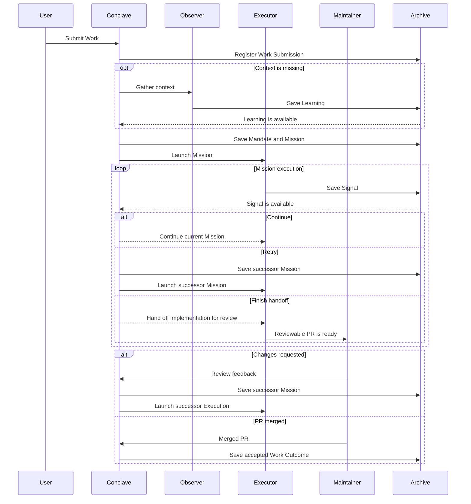

<div>
  


### khala
> Govern coding work with a Conclave, execute it in isolated sandboxes, and keep the evidence.
>
> [](https://github.com/pesap/khala)
> [](https://github.com/pesap/khala/actions/workflows/ci.yaml)
> [](https://github.com/pesap/forge/releases)
> [](LICENSE-MIT.txt)
> [](https://github.com/pesap/khala/commits/main)
<br/>
<br/>
<br/>

<p align="center">
  <a href="#why-khala">Why Khala</a> ·
  <a href="#features">Features</a> ·
  <a href="#pi-tools">Pi Tools</a> ·
  <a href="#quick-start">Quick Start</a> ·
  <a href="#documentation">Documentation</a> ·
  <a href="#development">Development</a>
</p>

Khala is a [Pi coding-agent](https://github.com/earendil-works/pi) extension for
coordinating serious repository work across specialized agent roles.

A user describes Work. A project-scoped Conclave validates it and decides
whether it is ready to execute. An isolated Executor performs the mission in
a Git worktree and reports evidence-bearing Signals. The Conclave reviews the
evidence and records a Verdict. When context is missing, a read-only Observer
gathers it first. Every durable transition is written to an append-only Archive.

> The principle: agents may act, but only evidence changes the record.

Khala is intentionally narrow. It does not replace your VCS, terminal
multiplexer, model provider, or project database. It composes those boundaries
and makes the lifecycle visible and recoverable.

## Why Khala

- Bounded roles. User Sessions, the Conclave, Observers, and Executors have
  different authority and different tools.
- Isolated execution. Executors work in Git worktrees instead of the caller's
  checkout.
- Evidence before judgment. Signals carry summaries and concrete evidence;
  Verdicts must reference a Signal from the same execution.
- Durable coordination. The project Archive survives sessions, panes, and
  launcher failures.
- Recoverable lifecycle. Failed launches can return to the queue, and Retry
  creates a successor execution rather than rewriting history.
- Observable by default. The Khala monitor shows the Conclave, Executors,
  Observers, states, signals, sandboxes, and live launcher targets.

## How it works

The target user-facing lifecycle is short. The Archive keeps the detailed
history behind it; see the [detailed lifecycle](docs/lifecycle.md). PR review,
merge integration, and Work Outcome recording are runtime-enforced when the
Maintainer review tools are used; external branch publication and PR creation
remain explicitly opt-in in Khala configuration.


```mermaid
sequenceDiagram
    participant U as User
    participant C as Conclave
    participant O as Observer
    participant E as Executor
    participant H as Maintainer
    participant A as Archive

    U->>C: Submit Work
    C->>A: Register Work Submission

    opt Context is missing
        C->>O: Gather context
        O->>A: Save Learning
        A-->>C: Learning is available
    end

    C->>A: Save Mandate and Mission
    C->>E: Launch Mission

    loop Mission execution
        E->>A: Save Signal
        A-->>C: Signal is available

        alt Continue
            C-->>E: Continue current Mission
        else Retry
            C->>A: Save successor Mission
            C->>E: Launch successor Mission
        else Finish handoff
            C-->>E: Hand off implementation for review
            E->>H: Reviewable PR is ready
        end
    end

    alt Changes requested
        H->>C: Review feedback
        C->>A: Save successor Mission
        C->>E: Launch successor Execution
    else PR merged
        H->>C: Merged PR
        C->>A: Save accepted Work Outcome
    end
```

The normal path is `Work → Mission → Execution → Reviewable PR → Accepted
Outcome`. Observer Learning, Preserver Counsel, Continue, and Retry are side
paths used when context, guidance, or recovery requires them. A merged PR is
acceptance; a merely closed PR is not.

The Archive is append-only. Current state is a projection of the latest record
for an entity; the complete history remains available for review and recovery.

## Features

- `/khala-work` loads the structured Work template.
- `/khala-triage` (also `/triage`) turns an issue into a WorkPacket, resolves uncertainty interactively, and sends approved Work to the Project Conclave.
- A dedicated, persisted project Conclave reviews and admits submitted Work under Mandate revision one.
- `/khala-demo` launches a three-lane lifecycle demonstration.
- `/khala` or `Ctrl+I` opens the session monitor.
- The bundled `pi-review` extension adds `/review` and `/end-review` for scoped code reviews.
- Observers record repository Learning before an Executor starts when context is
  incomplete.
- Zellij, tmux, and Herdr launchers are supported.
- The packaged Herdr skill teaches agents to inspect and control Herdr panes safely.
- Git worktrees provide Executor isolation.
- The Archive is stored as inspectable JSONL rather than hidden in a service.

## Pi tools

Khala exposes these custom Pi tools. Role restrictions are enforced at runtime;
normal User Sessions have no explicit Khala role marker.

| Tool | Purpose | Authorized role |
| --- | --- | --- |
| `khala_submit_work` | Submit a complete Work to the project Conclave; an active WorkPacket is optional. | User Session or Maintainer |
| `khala_read_archive` | Read authoritative Archive records visible to the current role. | Role-filtered |
| `khala_admit_work` | Admit a Work Submission and create Mandate revision one. | Conclave |
| `khala_launch_observer` | Launch a read-only Observer to gather missing Work context. | Conclave |
| `khala_record_learning` | Record evidence-backed repository learning. | Observer |
| `khala_launch_execution` | Materialize and launch the admitted Mission in an isolated Executor session. | Conclave |
| `khala_signal` | Submit evidence-bearing progress, blocked, or finished execution evidence. | Executor |
| `khala_verdict` | Record a Continue, Retry, Finish, or Reject decision for a Signal. | Conclave |
| `khala_counsel` | Record source-backed advisory Counsel. | Preserver |
| `khala_record_pull_request_review` | Record structured Maintainer review, merge, or closure evidence. | Maintainer |
| `khala_record_work_outcome` | Record the durable acceptance statement after a verified Pull Request merge. | Conclave |

## Install

Khala requires Node.js 22.19.0 or newer.

### From GitHub

```sh
pi install git:github.com/pesap/khala
```

Run `npx --yes github:pesap/khala` once to configure the launcher, worktree,
Pi commands, and Archive paths. The wizard writes global settings to
`~/.pi/agent/khala.json`; use `npx --yes github:pesap/khala --project` for a
project override. Use `npx --yes github:pesap/khala --dry-run` to preview the
resulting configuration.

### From a checkout

```sh
git clone https://github.com/pesap/khala.git
cd khala
npm install
npm run build
pi -e .
```

Khala is a Pi package. The package manifest registers the extension, prompts,
themes, and the Herdr skill.

## Quick start

1. Install Khala and open a project in Pi.
2. Run `/khala-triage <github-issue>` or `/khala-work`.
3. For triage, answer blocking questions and confirm the generated WorkPacket. Use
   `/khala-triage --approve <github-issue>` for independent submission.
4. For a manual Work, fill in the template, or ask the LLM to call `khala_submit_work` directly.
   `Objective`, `Scope`, `Acceptance criteria`, `Plan`, and `Validation` are required.
5. The Work is sent to the Project Conclave for admission and launch.
6. Open `/khala` to watch the Conclave and the isolated Executor.
7. Inspect the Archive when you need the authoritative lifecycle history.

For a deterministic walkthrough, run `/khala-demo`. It creates three dummy Work
lanes: direct success, retry then success, and retry then rejection. The demo
does not modify application source.

## Roles

| Role          | Authority                                   | Responsibility                                             |
| ------------- | ------------------------------------------- | ---------------------------------------------------------- |
| User Session  | Submit Work and observe                     | Defines intent and chooses when to request coordination.   |
| Conclave      | Launch Observer/Executor and issue Verdicts | Governs the project Work lifecycle.                        |
| Observer      | Record Learning only                        | Gathers missing repository context in a read-only sandbox. |
| Executor      | Record Signals only                         | Performs one exact mission in an isolated sandbox.         |
| Preserver     | Record Counsel only                         | Provides bounded, source-backed repository advice.         |
| Maintainer    | Define intent, bounds, review, and acceptance | Provides project-level direction for the system.           |

The role system prompts live in `system-prompts/` and are injected into clean
role sessions. They are not user-invoked slash prompts.

## Configuration

Global defaults live in `~/.pi/agent/khala.json`. A trusted project can override
individual values in `.pi/khala.json`.

```json
{
  "worktreeRoot": "~/worktrees",
  "worktreeBranchPrefix": "khala/",
  "launcher": "zellij",
  "piCommand": ["pi", "--extension", "/path/to/khala"],
  "observerPiCommand": ["pi", "--extension", "/path/to/khala"],
  "conclaveModel": "provider/model",
  "observerModel": "provider/model",
  "conclaveThinking": "medium",
  "executorThinking": "high",
  "observerThinking": "medium",
  "publishExecutorBranches": false,
  "pullRequestTargetBranch": "main",
  "commitConvention": "project",
  "archiveRoot": "~/.pi/agent/khala/conclaves"
}
```

`launcher` is `zellij`, `tmux`, or `herdr` and defaults to `zellij`. The Herdr
launcher must run inside a Herdr-managed pane (`HERDR_ENV=1`); it creates a
sibling pane without taking focus. Configured commands remain argument arrays;
Herdr quotes them for its `pane run` shell command. Run the setup wizard to choose
`conclaveModel` and `observerModel` from the models reported by
`pi --list-models`. The `conclaveThinking`, `executorThinking`, and
`observerThinking` values accept Pi's supported thinking levels or an empty
string for the Pi default. `publishExecutorBranches` enables the Git push and
`gh pr create --draft` workflow; it is disabled by default. `commitConvention`
can be `project`, `conventional`, or a custom commit prefix, and a Work
constraint beginning with `commit convention:` overrides it. `observerModel`
selects the read-only repository observation model. The project `archiveRoot`
override is used only when Pi marks the project trusted; untrusted projects use
the global Archive root. All reads and writes for one trusted session use the
same selected root.

The package ships named Khala prompts and role system prompts. Generic packaged
placeholder prompts are intentionally not included.

## Documentation

- [Glossary](docs/glossary.md) — Canonical Khala domain terms, roles, and
  record authorship.
- [Lifecycle](docs/lifecycle.md) — Detailed Work, Mission, Execution, review,
  Retry, and acceptance flow.
- [Data model](docs/data-model.md) — Archive envelope, records, lifecycle
  statuses, validation, and append-only state.
- [Art direction and generation prompts](docs/art-prompts.md) — prompts and
  image specifications for the Khala artwork.
- [Context](CONTEXT.md) — project vocabulary and authority boundaries.
- [Work template](templates/khala-work.md) — the structured request format.
- [Pull Request template](templates/pull-request.md) — the bundled Executor PR description format.
- [System prompts](system-prompts/) — role behavior and constraints.
- [Governed pi-review design](docs/design-governed-pi-review.md) — future Work/Executor/Signal flow.
- [Reusable Learning design](docs/design-reusable-observer-learning.md) — future cross-Work evidence rules.
- [Archive diagnostics design](docs/design-archive-diagnostics-recovery.md) — future read-only health tooling.
- [Bundled Pi extensions](extensions/) — extensions shipped with Khala, including `pi-review`.

## Development

```sh
npm install
npm run check
npm run build
npm test
```

`npm run check` runs Biome and TypeScript validation. Tests use local stubs and
do not require provider credentials or paid model calls.

The most important architectural seam is `src/khala-model.ts`: it is the single
source of truth for durable record shapes, discriminants, statuses, and guards.
Behavior modules import from it rather than defining their own persistence
models.

## Contributing

Keep changes focused and preserve the authority boundaries between User Sessions,
the Conclave, Observers, Executors, and the Archive. Add regressions to the
existing test suite, run `npm run check`, and run the relevant tests before
opening a pull request.

## License

MIT
