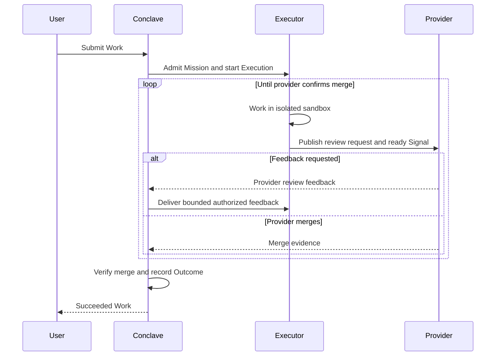

<div>


</div>

### khala
> Govern coding work with a Conclave, execute it in isolated sandboxes, and keep the evidence.
>
> [](https://github.com/pesap/khala)
> [](https://github.com/pesap/khala/actions/workflows/ci.yaml)
> [](https://github.com/pesap/khala/releases)
> [](LICENSE-MIT.txt)
> [](https://github.com/pesap/khala/commits)
<br/>
<br/>
<br/>

<p align="center">
  <a href="#khala">Why Khala</a> ·
  <a href="#core-boundaries">Features</a> ·
  <a href="src/index.ts">Pi Tools</a> ·
  <a href="#quick-start">Quick Start</a> ·
  <a href="#explore-the-repository">Documentation</a> ·
  <a href="docs/development.md">Development</a>
</p>


khala is a Pi-native governance extension for isolated coding work.
It keeps the
User conversation quiet while a Conclave admits Work, schedules a bounded
Executor in a Git worktree, records evidence, and waits for a
provider-confirmed review outcome.

The [Archive](docs/data-model.md) is authoritative for Work, Mission,
Execution, and Record state.
Runtime state, Git, provider responses, model output, and TUI views are
evidence or projections only.

> [!IMPORTANT]
> Review-request workflows require Node.js 22.19 or newer, Pi, Git, and an authenticated `gh` or `glab` session.

## Quick start

### Try Khala first

> [!TIP]
> Try the latest tagged release in a temporary Pi session before installing it.
> Pi loads the package for that run without adding it to your global or
> project settings.

```sh
pi -e git:github.com/pesap/khala@v1.1.0
```

### Install Khala for regular use

Install the latest Khala release from its Git tag:

```sh
pi install git:github.com/pesap/khala@v1.1.0
```

Pi installs packages globally by default.
To install Khala only for the current project, add `-l`:

```sh
pi install git:github.com/pesap/khala@v1.1.0 -l
```

For another GitHub repository, use the same form with its owner, repository,
and release tag:

```sh
pi install git:github.com/<user>/<repo>@<tag>
```

Then start Pi normally.

In Pi:

1. Open `/khala` and configure Conclave, Executor, and Oracle models in Role
   settings.
   Configure an Observer model when repository context gathering is needed.
2. Submit complete intent with `khala_submit_work`.
3. Reopen `/khala` to inspect Work through Actions, Evidence, Peer-Review, and
   Archive.

Use the Pi command `/khala-recover` after reopening a project when a child
session may have been interrupted.
See [Getting started](docs/getting-started.md) for the complete first-Work
workflow and verification steps.

## How Khala governs Work


```mermaid
sequenceDiagram
    participant U as User
    participant C as Conclave
    participant E as Executor
    participant P as Provider

    U->>C: Submit Work
    C->>E: Admit Mission and start Execution
    loop Until provider confirms merge
        E->>E: Work in isolated sandbox
        E->>P: Publish review request and ready Signal
        alt Feedback requested
            P-->>C: Provider review feedback
            C->>E: Deliver bounded authorized feedback
        else Provider merges
            P-->>C: Merge evidence
        end
    end
    C->>C: Verify merge and record Outcome
    C-->>U: Succeeded Work
```

The loop returns authorized provider feedback to the Executor until the
provider confirms a merge.
A `ready` Signal, review handoff, provider approval, or provider merge is not
acceptance.
Only an explicit Conclave Outcome backed by verified merge evidence succeeds
Work.
See the [full lifecycle loop](docs/lifecycle.md#lifecycle-loop).

## Commands and tools

- `/khala` opens the on-demand Work view and Role settings.
- `/khala-recover` rereads the Archive and reconciles persisted runtime
  bindings.
- `/khala-demo` opens a packaged read-only Archive containing representative
  Work and Execution states.
- `khala_submit_work` records User intent without waiting for admission.
- `khala_poll_provider` records changed GitHub or GitLab observations and
  confirmed merge evidence.
- `khala_read_archive`, `khala_inspect_runtime`, and the role-scoped action
  tools expose bounded evidence and governed decisions.

See the packaged [tool-usage skill](skills/khala/SKILL.md) for the complete
contract and action reference.

## Explore the repository

| Goal | Start here |
| --- | --- |
| Complete a first Work | [Getting started](docs/getting-started.md) |
| Understand states and recovery | [Lifecycle](docs/lifecycle.md) |
| Understand provider polling and effects | [Supervision tools](docs/supervision-tools.md) |
| Inspect records and runtime bindings | [Data model](docs/data-model.md) |
| Navigate the TUI | [TUI navigation](docs/tui-navigation.md) |
| Understand the design and limits | [MVP design](docs/mvp-design.md) and [glossary](docs/glossary.md) |
| Configure and recover Work | [Operations](docs/operations.md) |
| Develop or validate changes | [Development](docs/development.md) |
| Tune role behavior | [Role prompts](docs/role-prompts.md) |
| Extend Pi integration | [Pi extensions](docs/pi-extensions.md) |

<details>
<summary>Source map</summary>

- [`src/model.ts`](src/model.ts) — domain contracts and state discriminants.
- [`src/archive.ts`](src/archive.ts) — SQLite WAL Archive, projections,
  cursors, idempotency, and transactional outbox.
- [`src/service.ts`](src/service.ts) — lifecycle decisions, actor
  authorization, scheduling, governed commit/validation actions, effects, and supervision.
- [`src/runtime.ts`](src/runtime.ts) — isolated Pi JSON-RPC child sessions,
  bounded timeouts, process ownership, and transcript permissions.
- [`src/adapters.ts`](src/adapters.ts) — Git worktrees and GitHub/GitLab
  provider adapters.
- [`src/tui.ts`](src/tui.ts) — on-demand Work-first terminal interface.
- [`src/index.ts`](src/index.ts) — Pi tools, commands, role boundaries, and
  runtime wiring.
- [`system-prompts/`](system-prompts/) — role instructions for Conclave,
  Executor, Observer, and Oracle.
- [`skills/`](skills/) — tool-usage guidance packaged with Khala.

</details>

## Core boundaries

- The User submits intent and makes explicit review, rename, budget, failure,
  cancellation, and eligible recovery decisions.
- The Conclave admits Missions, schedules Executions, issues Verdicts, handles
  bounded provider feedback, and records Outcomes.
- The Executor changes files only in its isolated sandbox and under the
  Mission's permitted paths; the Mission itself remains immutable and the
  Executor reports evidence-bearing Signals.
- The Observer is read-only and records at most one bounded assessment when
  repository context is missing.
- The Oracle is advisory and has no tools.
- Child sessions are deny-by-default and receive only their role-scoped Pi and
  Khala tools; Executors have no arbitrary shell tool.
- Provider polling and runtime monitoring record evidence; they do not merge or
  accept Work automatically.
- GitHub and GitLab review requests support status and merge observation.
  GitHub feedback delivery is supported; GitLab feedback normalization is not.

## Bundled extensions

- [`pi-review`](extensions/pi-review/README.md) provides `/review` and
  `/end-review` for reviewing uncommitted changes, branches, commits, pull
  requests, and snapshots.
- [`pi-clarify`](extensions/pi-clarify/README.md) provides `/clarify` and the
  `-clarify` marker.
  It places a rewritten prompt in the editor for User review;
  it does not send the prompt.
- [`khala-demo`](extensions/khala-demo/README.md) provides `/khala-demo` for
  browsing a packaged read-only Archive without changing the live Archive or
  calling models.
