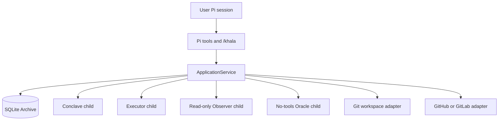

# Architecture

Khala separates intent, decisions, execution evidence, provider evidence, and
persistence. The Archive is the source of truth for Work projections and
append-only records.

The application service is the only component that applies lifecycle rules.
Tools are actor-scoped adapters. Children use parent-signed capabilities and
must reread the Archive before mutation.

## Source map

| Component | Responsibility |
| --- | --- |
| [`src/model.ts`](../src/model.ts) | Domain contracts and state discriminants |
| [`src/archive.ts`](../src/archive.ts) | SQLite WAL Archive, projections, cursors, idempotency, and outbox |
| [`src/service.ts`](../src/service.ts) | Lifecycle decisions, authorization, scheduling, effects, and supervision |
| [`src/ports.ts`](../src/ports.ts) | Runtime, workspace, provider, model, and Oracle interfaces |
| [`src/runtime.ts`](../src/runtime.ts) | Pi JSON-RPC children, bounded timeouts, process ownership, and private transcripts |
| [`src/adapters.ts`](../src/adapters.ts) | Git worktrees and GitHub/GitLab command adapters |
| [`src/index.ts`](../src/index.ts) | Pi tools, commands, role boundaries, and runtime wiring |
| [`src/tui.ts`](../src/tui.ts) | On-demand Work-first terminal interface |
| [`system-prompts/`](../system-prompts/) | Role instructions for child sessions |
| [`skills/`](../skills/) | Packaged tool-usage guidance |

## Persistence and supervision

Each resolved project path maps to a SQLite file under `archiveRoot`. SQLite
uses WAL mode and short `BEGIN IMMEDIATE` transactions. Archive appends validate
projections, preserve command idempotency, and enqueue external effects in the
transactional outbox.

The parent service processes effects one pass at a time. A transient Conclave
child startup failure receives a bounded retry; semantic decisions are never
silently retried. Service shutdown waits for monitor, effect, and background
runtime operations before closing the runtime and Archive.

Conclave and Oracle turns use ephemeral Pi sessions. Observer sessions may use a
persistent session path with a process-owned launch lease and private transcript
permissions. Executor sessions run in isolated Git worktrees. Raw child
transcripts are not copied into the Archive; bounded provider observations are
stored as untrusted evidence.

For lifecycle state rules, see [Lifecycle](lifecycle.md). For provider polling,
effect delivery, and runtime recovery, see [Supervision tools](supervision-tools.md).
For child-session behavior, see [Role prompts](role-prompts.md).
