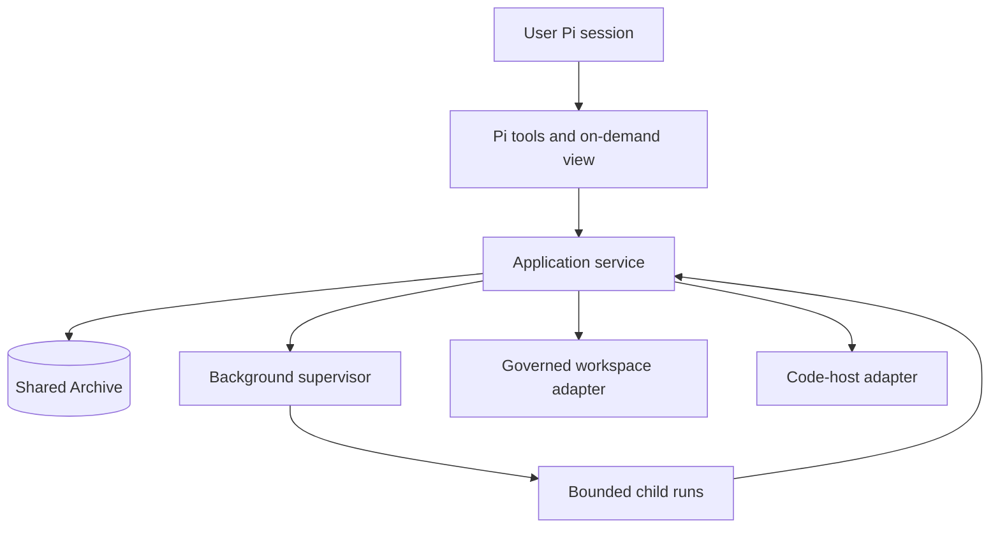

# Architecture

Khala separates judgment from the mechanics that make work durable and recoverable.
This document owns the target application boundary, supervision, scheduling, and effects described by the [MVP design](mvp-design.md).
Current implementation references are labelled separately; they do not establish that all target guarantees are implemented.

## Boundaries



The application service alone applies [lifecycle rules](lifecycle.md).
Tools and views are actor-scoped adapters, not alternative owners of state.
The Archive owns durable facts and projections under the [data contract](data-model.md).
Runtime, Git, models, and providers supply evidence or perform authorized effects.
The [security contract](security.md) governs role authentication, context access, isolation, and privileged operations.

There is one logical Conclave per User installation, not a permanently running agent or an ever-growing conversation.
Temporary Conclave runs handle admission, blockers, result judgment, and feedback.
Independent Work may receive concurrent decisions; decisions affecting the same Work are revision-checked.
Application code owns launching, observation, accounting, and delivery mechanics; routine progress observation does not require a model call.
Observer and Oracle are optional, not mandatory steps in every Mission.

## Supervision and recovery

One background supervisor holds an exclusive lock for the shared Archive and consumes durable outbox effects, including Executor launches.
A competing supervisor cannot process effects while the lock is held.
Acquiring the lock after a crash does not release persisted workspace ownership.
The supervisor is ordinary application code, not a global model conversation or a fleet of per-repository supervisors.

Closing or switching the initiating User Pi session disconnects the interface without cancelling workers or waiting for completion.
A new Pi session reconnects to the same Archive and reconciled status.
After restart, the supervisor reconciles persisted bindings and pending effects before launching replacement processes.
Conclave children cannot kill Executors as part of their own shutdown or impersonate the supervisor.

Runtime liveness comes from persisted bindings and a bounded Pi RPC probe; it is not lifecycle authority.
Unexpected loss of an Executor requires reconciliation; Work remains active until an authorized recovery, replacement, or explicit failure decision.
An expected child exit while awaiting a recorded next action is not a failure and must not trigger recovery merely because no process is live.
The [lifecycle stop protocol](lifecycle.md#cancellation-recovery-and-retention) requires confirmed process-tree termination before replacement or ownership release.
Shutdown must preserve unresolved bindings and ownership when termination cannot be confirmed.

## Scheduling and child runs

Admitted Work is scheduled FIFO among eligible Missions when allowance, configured concurrency, and workspace ownership permit it.
Queued Work has no running Pi process.
One writer is allowed per assigned worktree and writable branch; semantic conflicts between independent branches are not scheduled or detected by this MVP.

Every invocation has the durable run identity defined in [Data model](data-model.md#child-run-facts).
A child waiting for another role exits and releases its concurrency slot before that dependent role launches.
Executors release live resources after a ready or blocked Signal, before Conclave judgment.
Conclave runs similarly exit before waiting for Observer or Executor work.
A later run reloads bounded Mission context and evidence rather than retaining an idle process or unlimited transcript.
Saved run facts distinguish expected completion or waiting from unexpected interruption and identify the next authorized action.
This applies to Oracle requests too: the requesting Conclave must not consume the capacity needed for the Oracle to run.
The whole loop must work with total concurrency set to one.

[Operations](operations.md#allowances-and-limits) owns the total child ceiling, correction allowance, reservation, and exhaustion rules.
No separate machine-wide resource scheduler is required.
Token price is not a memory limit; validation and build subprocesses belong in process-tree measurements.

## Commands and reads

Every lifecycle mutation carries `CommandMeta`: command ID, actor, expected Work revision, schema version, and applicable role bindings.
Role settings are configuration changes rather than lifecycle mutations and never replace the User's active Pi settings.
The service revalidates actor, state, input, revision, and authorization instead of deriving permission from labels.

Clients retain pending command IDs and exact input across disconnects until the outcome is known.
Command status is readable through this same application boundary.
Retrying identical input with the same ID returns the recorded status or result; reusing an ID with different input is rejected.
An identical transport retry is not a new semantic decision and cannot repeat a completed effect.
Revision conflict preserves User input and requires a reread, not an automatic semantic retry.

Target reads provide:

- Filtered, paginated Work summaries and a small footer summary.
- One Work with revision-bound actions and its current input request.
- Its current review snapshot, base and head, and an on-demand bounded local diff.
- Record summaries and selected bounded record bodies.
- Effective role settings, applicable guidance, attention reasons, and pending command status.

These are bounded views through one application boundary, not a new service for each panel.
Current questions and provider snapshots are directly readable, not reconstructed from arbitrary record pages.
Footer reads do not load all Work, and opening one record does not retain the whole Archive.
Each read revalidates repository and role access and reports snapshot identity or freshness where relevant.

Actions expose opaque ID, Work scope, kind, label, enabled state, disabled reason, and expected revision.
The target also identifies required input and consequential confirmation, including exact-snapshot local acceptance and changed-term approval.
The [interaction contract](tui-navigation.md) owns how those facts are presented.

Expected failures through `perform` use `ErrorEnvelope` with code, summary, retryability, remediation, evidence references, and optional learning data.
The Pi adapter converts direct submission errors into tool errors.
Failures must not look like successful mutations.

## External effects and monitoring

Every external effect has a stable Khala ID and uses ensure or reconcile semantics where supported.
Effects are enqueued atomically with their causative Archive decision.
After an unknown result, reconcile before retrying; never silently retry a semantic decision, substitute a model, increase an allowance, change scope, or redeliver completed feedback.

Local Git belongs to the workspace adapter; remote review requests belong to the code-host adapter.
The Mission's stored authorized provider target selects the adapter rather than mutable origin configuration.
Provider capability is checked before publication.
The target includes GitHub and GitLab draft review requests and merge observation.
GitHub polling normalizes checks, issue comments, submitted reviews, inline comments, and outcomes.
GitLab polling normalizes CI/review status and outcomes without comment or check normalization.

Monitoring emits observations, not Signals or Verdicts.
Only published Work is polled for provider state.
Changed observations are durable; unchanged nonterminal polls update an in-memory heartbeat.
Unsettled merge evidence is durably queued for Conclave settlement.
Transport failures use bounded retries before becoming actionable attention, not unlimited model wakes.
The [lifecycle](lifecycle.md#feedback-and-correction) owns feedback authorization and explicit failed-delivery retry; [Operations](operations.md#allowances-and-limits) owns timing.

## Current implementation reference

The current application surface is not the complete target read contract:

```text
submitWork(input, meta)                         -> WorkView
listWork()                                      -> readonly WorkSummary[]
inspectWork(workId)                             -> WorkView
inspectRuntime(workId, meta?)                   -> Promise<WorkView>
availableActions(workId, actor, revision?, runtimeState?) -> readonly Action[]
perform(command)                               -> Promise<ServiceResult<WorkView>>
readRecords(query, meta, cursor?)               -> Page<RecordView>
readRecordSummaries(query, meta)                -> Page<RecordSummaryView>
pollProvider(workId, meta)                      -> Promise<WorkView>
```

The current port methods likewise describe an implementation boundary, not additional domain concepts:

```text
ArchivePort       append, updateCommandProjection, findCommand,
                  pendingEffects, completeEffect, releaseEffect, renewEffect,
                  query, querySummaries, project, findObservation, findLatestObservation,
                  listProjects, close
AgentRuntimePort  ensureSession, send, getState, requestStop, close
WorkspacePort     preflight, ensureSandbox, inspectHead, inspectChanges,
                  commitSandbox?, runValidation?, publishSandbox, removeSandbox
CodeHostPort      capabilities, identity, ensureReviewRequest, poll, inspectOutcome
ModelCatalogPort  listScoped, resolve
OraclePort        review
```

Optional current workspace methods do not waive target validation requirements.
Current actions do not populate input schemas or confirmation metadata; those remain required by the target reads above.
The current extension owns its application runtime in the User Pi session and closes it on `session_shutdown`.
Project-scoped storage and those session-bound runtime bindings do not implement the target shared background supervisor.
See [Operations](operations.md#current-configuration-reference) for current settings and [Application actions](supervision-tools.md) for tool entry points.

## Source map

| Component | Responsibility |
| --- | --- |
| [`src/model.ts`](../src/model.ts) | Domain contracts and state discriminants |
| [`src/archive.ts`](../src/archive.ts) | SQLite Archive, projections, cursors, idempotency, and outbox |
| [`src/service.ts`](../src/service.ts) | Lifecycle, authorization, scheduling, and effects |
| [`src/ports.ts`](../src/ports.ts) | Runtime, workspace, provider, model, and Oracle boundaries |
| [`src/runtime.ts`](../src/runtime.ts) | Pi RPC children, timeouts, ownership, and transcripts |
| [`src/adapters.ts`](../src/adapters.ts) | Git workspaces and code-host adapters |
| [`src/index.ts`](../src/index.ts) | Pi tools, commands, role bindings, and wiring |
| [`src/factory.ts`](../src/factory.ts) | Current application runtime construction |
| [`src/runtime-storage.ts`](../src/runtime-storage.ts) | Runtime ownership and artifact storage |
| [`src/tui.ts`](../src/tui.ts) | On-demand interaction |
| [`src/archive-view.ts`](../src/archive-view.ts) | Bounded Archive presentation |
| [`system-prompts/`](../system-prompts/) | Child role instructions |
| [`skills/`](../skills/) | Packaged tool guidance |

## Checks before relying on supervision

Complete the loop with concurrency one, including optional Observer and Oracle help, then exercise independent Work across repositories.
Verify expected child exits advance the recorded next action without triggering recovery, while unexpected interruption requires reconciliation.
Start a competing supervisor, crash the owner after an external effect, and reconcile without duplicate writers or effects.
Lose a command response, reconnect, and resolve the original ID; reject that ID with changed input.
Verify bounded reads and that navigation alone does not launch children or poll providers.
