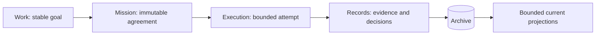

# Data model

The data model sustains memory by preserving intent, agreements, attempts, and the evidence needed to continue safely.
This document owns the target data contract from the [MVP design](mvp-design.md).
It does not claim that the current TypeScript types or SQLite schema implement every target field.
[Lifecycle](lifecycle.md) owns transitions; [Architecture](architecture.md) owns application reads and commands; [Security](security.md) owns access enforcement.

## Durable primitives

Khala has four durable primitives: Work, Mission, Execution, and Record.
Roles, child runs, review snapshots, attention, and guidance do not require additional coordinating agents or top-level domain primitives.
Their durable facts are represented by Records and bounded current projections.

### Work

Work is the stable User goal, identified independently of its label.
It retains submitted intent, the current Mission binding, budget and correction accounting, acceptance evidence, and current revision.
Its nonterminal states are `submitted`, `needs-input`, `queued`, `active`, and `awaiting-review`.
Terminal states are `succeeded` and `stopped`; stopped Work records `stopReason` as `failed` or `cancelled`.
Renaming changes the Work label, not the immutable admitted agreement.
A budget amendment creates a `work-amended` Record.

### Mission

Mission is one immutable agreement containing objective, scope, acceptance criteria, constraints, validation requirements, permitted paths, authoritative context references, repository target, and delivery mode.
Admission pins the agreement rather than retaining mutable references to submission defaults.
A changed agreement creates a successor with `predecessorMissionId` and a `mission-change` Record containing reason, User approval, evidence, and disposition.
The predecessor remains reviewable while the successor becomes the current projection.
The [lifecycle](lifecycle.md#admission-and-amendment) defines when such a change is authorized.

### Execution

Execution is one bounded attempt at a Mission, binding model, thinking mode, prompt identity, allowance, assigned workspace, branch, and Pi runtime binding.
A Mission has at most one active Execution; historical Executions remain available through Records.
Execution states are `queued`, `running`, `awaiting-review`, `completed`, `blocked`, `failed`, and `stopped`.
A blocked attempt records its reason, including `budget-exhausted` when applicable.
A saved Execution is not proof of a live process and does not by itself occupy a child-run concurrency slot.
Recovery may rebind that Execution rather than creating a replacement.
An Executor's transient implementation plan is not another immutable agreement.

### Record

A Record is one immutable fact with actor, Work/Mission/Execution bindings when applicable, payload version, summary, evidence references, and timestamp.
It exposes an opaque ID, Archive sequence, global record number, optional per-Mission record number, kind, and bounded payload.
Signals and validation bind to an Execution.
Observer assessments and provider observations are Work-level evidence but retain the result identities needed to assess applicability.
They do not amend Mission identity.

## Repository and workspace identity

The canonical Git common directory identifies a local repository independently of linked worktree paths.
Linked worktrees share that identity; separate clones remain separate workspace boundaries even when they share a remote.
A moved or missing common directory requires attention rather than automatic reassociation.
No separate User-defined project entity is required.

A Mission records its base branch and resolved base commit.
Provider delivery separately records the authorized provider repository and target branch so changes to local Git configuration cannot retarget effects.
An Execution records its assigned worktree and branch, including whether the workspace is Khala-owned or explicitly assigned by the User.
Ownership survives loss of runtime contact until the [termination rule](lifecycle.md#cancellation-recovery-and-retention) is satisfied.

## Child-run facts

Every child invocation, including a Conclave wake, has a durable run ID.
Run facts bind role, Work, Mission and Execution when applicable, model, thinking mode, prompt identity, runtime binding, reservation, and usage.
One Execution may have multiple sequential runs; a correction pass and a runtime invocation are not interchangeable identities.
Prompt identity records the package version and prompt digest needed to explain what ran.

Reservations and usage changes are durable and idempotently tied to the run.
Input and output consumption remain inspectable by role and attempt; cache counters remain metadata rather than a second charge.
Outstanding reservations and uncertain usage survive crashes.
The [operations contract](operations.md#allowances-and-limits) owns reservation release, exhaustion, and allowance policy.

Runtime liveness is a separate observation using `working`, `pending`, `idle`, `unreachable`, or `unknown`.
Bindings and a bounded RPC probe supply that observation; a PID alone does not establish activity.
Raw transcripts are not Archive records.

## Review snapshots

Each ready result has an immutable snapshot binding repository, Mission, Execution, base, head, declared validation results, and provider request when applicable.
Handoff selects that snapshot and exposes commit sequence, diff evidence, summary, and remaining concerns.
Acceptance and feedback authorization identify the snapshot they describe.
New commits require a new snapshot; older evidence remains available rather than being silently rebound.

Validation results identify the command, exact head, success or failure, and bounded output or artifact references.
Evidence must describe the reviewed commit, not a subsequently modified working tree.
The files being checked must match that commit before and after validation, apart from declared validation artifacts that do not change the reviewed source.
Changes to the head or reviewed source during validation invalidate the result; fresh evidence is required for the resulting commit.
Recording a commit ID beside a successful command does not by itself establish this correspondence.
Provider evidence retains native request IDs, repository and branch identity, source head, merged result identity, URLs, and bounded observations.
Merge verification may connect different source and resulting commit IDs for squash or rebase outcomes.

Provider observation kinds include `ci-status`, `review-comment`, `feedback-delivery`, `monitor-failure`, and `provider-outcome`.
Each kind uses its own status vocabulary rather than one ambiguous generic status field.
Edited provider text creates a new observation; previous observations and completed Deliveries remain immutable.
Provider text remains evidence under the [security contract](security.md#provider-feedback).

## Guidance and context

User feedback is retained even when it produces no reusable lesson.
The Conclave distinguishes current-Mission corrections from candidate guidance for future Missions.
A lesson records concise guidance, source feedback references, applicability to a Work, repository, or explicitly shared scope, and active or withdrawn status.
Only the User confirms promotion and may inspect, amend, or withdraw guidance.
Amendment and withdrawal preserve the original evidence.

Admission pins immutable versions of applicable guidance and authoritative context in the Mission.
Resumed and replacement runs under that Mission receive the same pinned versions.
Withdrawal excludes guidance from new Missions, including successors; it does not rewrite existing agreements.
Changing an existing Mission's pinned guidance requires an approved amendment.
Referenced content remains reviewable rather than depending on mutable file paths.

Repository-specific guidance is not applied elsewhere merely because it shares the Archive.
Current instructions, scope, and acceptance criteria take precedence over lessons; conflicts require clarification rather than silent changes.
Learning is explicit retrieval of reviewed guidance, not model training or a guarantee of improvement.
Evaluation requirements remain in the [MVP design](mvp-design.md#evidence-before-expanding).

## Current projections and attention

Current projections expose Work summaries, current input requests, review snapshots, applicable guidance, and pending operations without requiring a view to scan arbitrary records.
Attention is derived by the service from unresolved requests and operations plus unacknowledged terminal failures.
Each reason has evidence references and permitted responses.
Resolution clears its reason; acknowledging a terminal failure clears that reason without deleting History or hiding other unresolved operations.
These are projections over durable facts, not another history system.

Recorded acceptance awaiting Conclave settlement is an acceptance fact and waiting reason, not a new Work state.
Runtime stop requests remain distinguishable from confirmed process termination.
Command identity and status remain durable so a disconnected client can reconcile its original request.
The [application contract](architecture.md#commands-and-reads) defines replay and conflict behavior.

## Archive durability

The target has one shared Archive per User installation, outside active User checkouts.
SQLite uses WAL mode and short `BEGIN IMMEDIATE` transactions.
Each append checks the expected Work revision, writes the Record, updates its projection, and enqueues external effects atomically.
A transaction failure does not leave only part of the decision recorded.

First creation writes an initialization marker beside the database.
An existing marker with a missing database fails closed rather than silently replacing the Archive.
Schema creation only initializes an empty, unmarked database and is transactional.
Existing Archives are validated without migrations or automatic repairs.
Missing tables, obsolete Work shapes, inconsistent record identities, and integrity failures fail closed; failed initialization closes its connection.
Backup and restore are operator responsibilities described in [Operations](operations.md#archive-backup-and-privacy).

## Queries

Record queries compose Work, Mission, Execution, kind, state, and time filters with AND.
Repeated kind and state values compose with OR.
Results are ordered by Archive sequence.
A cursor binds normalized filters, an as-of sequence, and the last returned sequence.
Every page revalidates actor and role access rather than embedding permission in the cursor.
Reads retain only bounded pages and selected record bodies, not the entire Archive.

## Current implementation reference

The existing discriminants and storage layout are defined by [`src/model.ts`](../src/model.ts) and [`src/archive.ts`](../src/archive.ts); they are not a complete implementation of the target contract above.
The existing SQLite tables include `archive_records`, `archive_record_numbers`, `work_projection`, and `outbox`.
Record kinds include `submission`, `assessment`, `learning`, `mission`, `mission-change`, `execution`, `validation`, `signal`, `review-request`, `observation`, `delivery`, `verdict`, `oracle-review`, `outcome`, `error`, and `work-amended`.
Current projection parsing validates Work/Mission/Execution relationships, budgets, exact discriminants, row identity, revision, and queue sequence.
Stored command replay uses its original projection snapshot rather than substituting the latest Work.
Opening an Archive validates stored projections, while ordinary Work inspection selects the requested projection.

Shared repository targeting, workflow-wide run accounting, local acceptance, version-pinned guidance, and the target review and attention projections remain design requirements until implemented and verified.
Do not infer their availability from the existence of similarly named current fields.

## Checks before relying on memory

Round-trip an immutable Mission amendment, review snapshot, child-run reservation, and guidance version without losing predecessor evidence.
Validate with changed source before or during a check and verify that the result cannot be attributed to the unchanged reviewed commit.
Verify same-command replay, stale-revision rejection, bounded snapshot pagination, and cross-repository access rejection.
Crash between effect execution and acknowledgement and reconcile without duplicating the effect or charging usage twice.
Withdraw guidance before a new Mission and before an existing Mission resumes; verify the specified version behavior in both cases.
