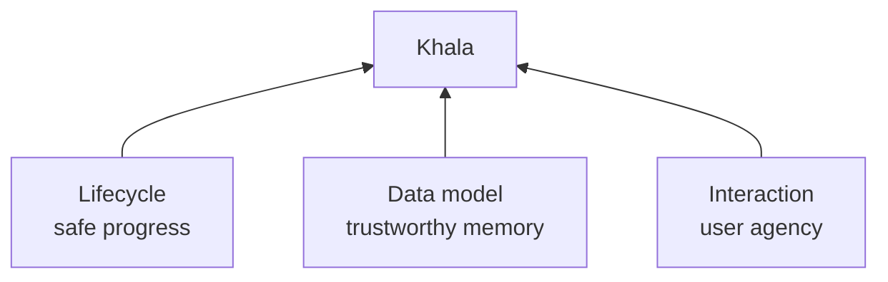
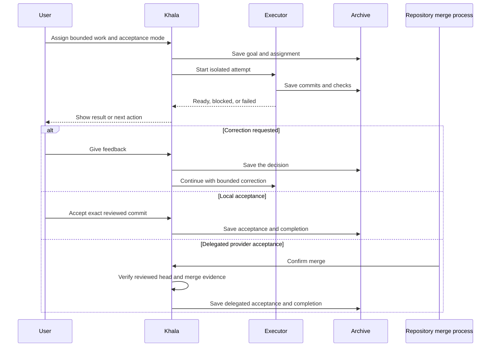
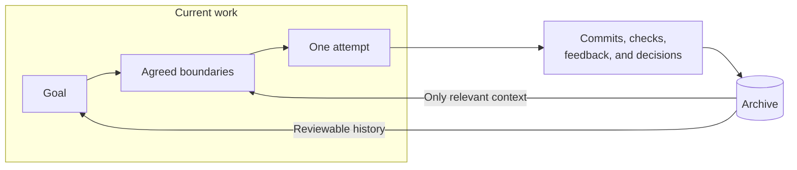
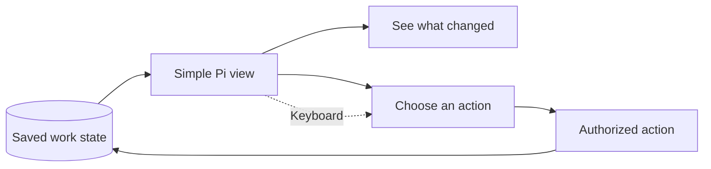
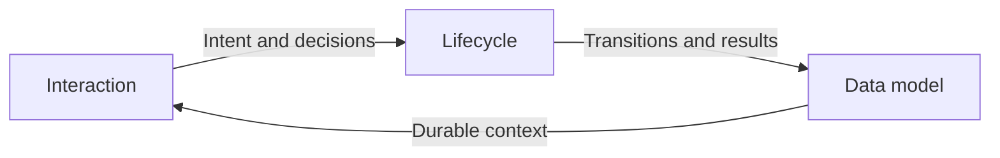

# Khala foundations

Khala is a quiet forge for coding work that continues while you focus elsewhere.
You give it a meaningful assignment, it carries out the work in an isolated Git worktree, and it brings back a result you can understand and review.

> “For we are bound by the Khala, the sacred union of our every thought and emotion.”
>
> — Artanis, *Legacy of the Void*[^2]

Khala is not another chat window to supervise.
It is not a dashboard for watching agents think.
It is not an autonomous system that silently changes your repositories.
It is a trusted layer between your intent and work performed on your behalf.

Three pillars sustain Khala:

> [!IMPORTANT]
> These pillars are the foundation for Khala's design and architecture.
> A feature that weakens one of them needs a clear reason to exist.

- Lifecycle sustains progress.
- Data model sustains memory.
- Interaction sustains agency.

These are not features or workflow questions.
They are the ideas that must remain true as Khala grows.

## Why build Khala

Coding agents are useful when you are present and directing them.
They are less useful when you have several repositories, several ideas, or a result that needs time to produce.
A normal agent conversation ties progress to one window, one working directory, and one active train of thought.

Khala exists to separate your attention from the work without separating you from responsibility for the result.
You should be able to assign a bounded task, close Pi, and return later without guessing what ran, what changed, or whether it is safe to continue.

The value is not the number of agents Khala can start.
The value is reliable delegation:

> [!TIP]
> Start with a small assignment that has a clear result and a simple check.
> Khala should earn trust through one completed loop before it takes on more autonomy.

- Your active conversation stays focused.
- Work happens in an isolated workspace, either created by Khala or explicitly assigned and dedicated to the attempt, separate from your active checkout and other writers.
- Commits and checks give you something concrete to review.
- A stopped attempt leaves an explanation and preserves its useful work.
- Feedback improves the current assignment without becoming an uncontrolled instruction.
- A new Pi session can recover the same work from durable facts.

## Who Khala is for

Khala is for people who already use Pi and want to extend their reach without turning their day into process management.

It may be useful for:

- Developers moving between several repositories or worktrees.
- Maintainers who want small fixes or investigations to progress in parallel.
- Reviewers who want an agent to prepare a change while controlling acceptance directly or through their repository's merge process.
- Teams that need a durable account of assignments, decisions, checks, and feedback.
- People who prefer keyboard-driven tools and concise status over dashboards and notifications.

Khala is not intended to replace judgment.
It is not a promise that an agent will always finish a task.
It is a way to make delegation bounded, visible, and recoverable.

## What makes Khala distinctive

Khala combines several familiar ideas around one promise: useful work should survive the conversation that started it.
The names Conclave, Executor, Observer, Oracle, and Archive describe responsibilities in that system, not a hierarchy you must administer.

### Pi-native, not Pi-adjacent

Khala lives inside Pi.
It should feel like a new path through the same command center, not a second bridge beside it.
It uses Pi's editor, theme, keybindings, model settings, and extension model.
The interface is quiet and on demand rather than a separate web application or permanent control room.

Child sessions do the work away from the user's active conversation.
Their traffic does not fill the conversation, and their settings do not silently replace the user's settings.

### Reviewable, not merely completed

Khala does not treat a worker's final message as proof of success.
A useful result has a repository, workspace, commit, check results, and a clear relationship to the assignment.
A worker's handoff makes a result available for review; it does not itself constitute acceptance.
For local delivery, you accept the exact reviewed commit in Pi.
By explicitly authorizing provider delivery, you delegate acceptance to the repository's merge process, including its permitted maintainers and automation.
Khala verifies the merged result and records completion without requiring a second acceptance in Pi.
This delegation does not authorize Khala to merge code.

### Durable, not session-bound

The Archive preserves the goal, assignment, attempts, evidence, decisions, and feedback.
Useful context should remain available after an individual session ends.
A live process is only one part of the system.
If Pi closes or a worker stops, the work remains understandable and recoverable.

### Coordinated, not conversationally crowded

The Conclave coordinates assignments without becoming a permanent group chat.
Executors work on bounded Missions.
Observers gather missing facts when needed.
Oracles provide independent assessment when useful.
These roles support the work; they do not create a bureaucracy the user must operate.

### Controlled, not silently autonomous

Khala can launch work and handle routine mechanics.
It cannot silently expand scope, increase spending, merge code, or turn untrusted feedback into authority.
You remain responsible for boundaries, feedback, and the choice to accept directly or delegate acceptance to the repository's merge process.
Background supervision and monitoring stay within those authorized boundaries and limits; they do not create new authority.
An isolated worktree is not a process security boundary: children and checks must also be restricted to authorized resources, without publication credentials or direct Archive access.
If that isolation cannot be established, work does not launch.

## The three pillars

### Lifecycle sustains progress

Khala must make it possible for work to move safely from intention to result without requiring supervision of every turn.
Progress includes execution, waiting, review, correction, recovery, and stopping.
Each transition has an authorized owner and a visible result.

Lifecycle principles:

- An active assignment has a clear next step.
- Every consequential action has an authorized owner.
- Independent work can progress without keeping the initiating Pi conversation open.
- A result is distinct from its acceptance.
- Feedback can produce a bounded correction without creating an endless loop.
- A blocked or failed attempt explains what happened and what can happen next.
- An interrupted attempt retains workspace ownership until its process tree is confirmed stopped; uncertainty never authorizes a replacement writer.
- Unfinished work is preserved when progress stops.
- Changed assignment terms require approval of the exact successor agreement; corrections within unchanged terms remain bounded Conclave decisions.
- Clarification is available before and after work begins.
- Changes to spending, publication, or other consequential behavior require authorization.
- Waiting for another role must not consume the capacity needed for that role to run.
- Acceptance awaiting settlement remains visible without silently increasing the budget.

The lifecycle is about continuity and responsibility.
It should not require the user to operate scheduling, process, or recovery machinery.

### Data model sustains memory

Khala must preserve the facts needed to understand work after a worker, process, or Pi session disappears.
The data model separates the user's goal, the agreed assignment, each attempt, and the history of what happened.

Data-model principles:

- Goals, assignments, decisions, commits, check results, and feedback survive live sessions.
- Review, validation, feedback authorization, and acceptance identify the exact result snapshot they describe; new commits do not inherit old readiness.
- Repository and workspace identity are explicit.
- Changes to an assignment preserve the previous agreement and the reason for changing it.
- Shared storage does not imply shared context between repositories.
- Each agent receives only relevant instructions, facts, and approved guidance.
- Provider comments and agent output remain evidence rather than permission.
- Reusable guidance is explicit, scoped, approved by the user, and pinned by version in each assignment.
- Withdrawal excludes guidance from new assignments; changing an existing assignment's pinned guidance requires an approved successor agreement.
- Saved state distinguishes a running process from a recoverable attempt and preserves each child invocation's identity and usage.

The Archive is not an ever-growing transcript.
It stores the facts needed for safe continuation and meaningful review.

> “Guard us while we preserve our knowledge for those that may follow.
> They must not make the mistakes we did.”
>
> — High Templar, *In Utter Darkness*[^1]

### Interaction sustains agency

Khala must let the user understand and direct work without leaving Pi or learning its internal machinery.
The interface makes progress legible and decisions easy to find.

The default experience is quiet and keyboard-first.
It uses Pi's editor, theme, configured keys, and normal text behavior.

Interaction principles:

- Find work that needs attention without navigating an organizational hierarchy.
- Reach every essential action with the keyboard.
- Use simple lists, visible selection, and consistent navigation.
- Keep normal typing, multiline paste, and editing separate from list navigation, with explicit Submit and Discard actions.
- Put actions beside the information that explains them.
- Show goals, results, and requests for input before internal identifiers and states.
- Load detailed history and technical metadata only when requested.
- Preserve selection and drafts across navigation, refreshes, and failed requests.
- Distinguish leaving a view from cancelling work.
- Distinguish requesting an action from confirming that it succeeded.
- Communicate status with text, not color alone.
- Never present a delayed or disconnected mutation as successful; reconcile the original request before issuing another decision.
- Resolved attention clears without erasing history; acknowledging a terminal failure does not erase its evidence.

Interaction is about agency and orientation.
It must not recreate lifecycle authority by interpreting labels or reconstructing decisions from arbitrary records.

> “Trust in each other.
> Strike as one will!”
>
> — Artanis, *In Utter Darkness*[^1]

## How the pillars reinforce one another

The pillars form a loop rather than a hierarchy.

1. Interaction captures intent and presents the current situation.
2. Lifecycle coordinates authorized work and determines the next transition.
3. The data model preserves the transition, its evidence, and its result.
4. Interaction presents the saved state so the user can continue or decide.

A simple interface cannot compensate for unreliable recovery.
Detailed history cannot compensate for an unclear next action.
A trustworthy Archive cannot compensate for a lifecycle that loses work.

## Simplicity is the design test

Simplicity is a constraint across all three pillars, not a fourth pillar.
Keep the guarantees that protect work, but do not require the user to operate the machinery that provides them.

Before adding a concept, role, state, or panel, check whether it strengthens one of the three ideas:

- Does it help work progress safely?
- Does it preserve a fact needed for continuation or review?
- Does it improve the user's understanding or control?

If it does none of these, remove it.
If an existing concept can carry the responsibility, do not add another layer.
If a technical distinction does not change a user's decision, keep it out of the primary interaction.

These foundations guide the [MVP design](mvp-design.md), which keeps the goal, boundaries, and path from one working loop together.
The details belong in [Lifecycle](lifecycle.md), [Data model](data-model.md), and [TUI navigation](tui-navigation.md), supported by [Architecture](architecture.md), [Operations](operations.md), and [Security](security.md).
Each contract has one home and explains how Khala sustains these ideas without turning internal machinery into user work.

> [!NOTE]
> The foundations describe intent and boundaries.
> The detailed contracts describe the intended guarantees; current implementation references are explicitly labelled.
> A documented requirement is not proof that it has been implemented or verified.

[^1]: [In Utter Darkness transcript](https://www.blizzplanet.com/blog/comments/in-utter-darkness-starcraft-ii-wings-of-liberty-single-player-transcript).

[^2]: [Legacy of the Void campaign quotations](https://starcraft.fandom.com/wiki/StarCraft_II:_Legacy_of_the_Void_campaign_quotations).
