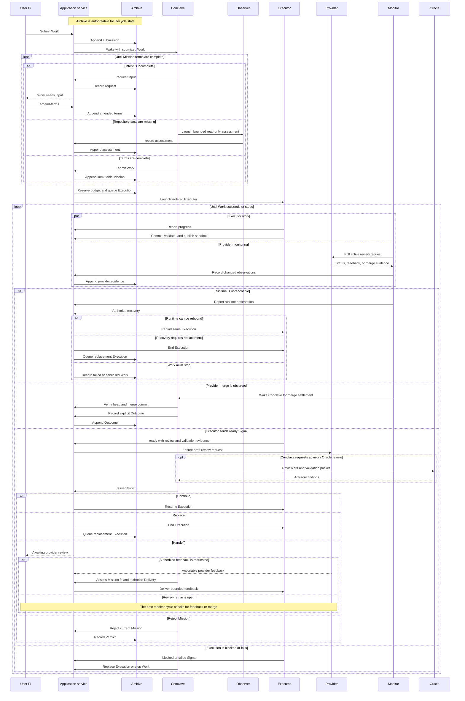

# MVP lifecycle

Khala separates User intent, Conclave decisions, Executor evidence, provider evidence, and Archive persistence.
The Archive is authoritative for lifecycle state.

## Lifecycle loop

The diagram shows the durable lifecycle interactions and the loops around
admission, execution, provider review, feedback delivery, polling, and runtime
recovery.
Polling records observations and can wake the Conclave, but it never merges or
accepts Work by itself.
Only verified provider merge evidence combined with an explicit Conclave
Outcome produces `succeeded` Work.

## Submission and admission

`khala_submit_work` validates a title, objective, and acceptance criteria, then applies documented defaults and appends a `submission` Record.
It returns without waiting for the Conclave child.

The Conclave can request more intent with `request-input`.
The Work becomes `needs-input` until the User amends its pre-admission terms with `amend-terms`.
Admission is not available while Work is in `needs-input`.
A missing repository fact may launch one read-only Observer.
The Observer records exactly one bounded `assessment` and stops.

The Conclave admits complete terms into an immutable Mission.
An inactive Mission can be amended only by the Conclave.
That action creates a successor Mission and `mission-change` evidence with predecessor, reason, evidence, and disposition.

The scheduler orders admitted Work by Archive sequence.
It starts a Work only when the project concurrency limit and its remaining token budget permit an Execution reservation.
Work that cannot start remains queued with the relevant waiting message.

## Execution

The Executor receives one Mission in an isolated Git worktree and a separate Pi JSON-RPC session.
Model, thinking level, token allowance, sandbox, permitted paths, and prompt identity are persisted before the child starts.

Each Execution reserves half of the configured Work token cap with a minimum allowance of one token.
Observed input and output tokens are charged as turns complete.
When usage reaches the allowance, the Execution becomes `blocked` with `blockReason` `budget-exhausted`.
The Conclave must replace it or amend the Work budget.
A single Pi turn may overshoot because the RPC interface does not expose a per-session output limit.
Each Executor change has a fixed hard cap of 500 added code lines across the aggregate sandbox diff, including multiple commits in one Execution.
Commit, publication, and ready actions are rejected above the cap, and the sandbox changes remain available for reduction.

Only the current Executor can send `progress`, `blocked`, or `ready` Signals.
A ready Signal requires a reconciled review request for the current sandbox head, validation evidence, and a permitted-path check.
An Execution may remain `running` while its Pi runtime is `idle` between turns.
Runtime observations are stored separately from lifecycle state.

## Review and Verdict

The Executor commits and publishes the sandbox branch before creating or reconciling a draft review request.
The target branch must still point to the Execution base commit when publication begins.
GitHub Pull Requests and GitLab Merge Requests are supported.
GitHub feedback delivery is supported.
GitLab status and merge observation are supported, but GitLab feedback normalization is outside the MVP.

Only the Conclave can issue a Verdict.
`continue` keeps a non-exhausted Execution running.
`replace` ends it and starts a replacement under the same Mission.
`handoff` moves the Work to User review after a ready Signal.
`reject` ends the current Mission without automatically failing or cancelling Work.

A ready Signal, provider approval, and handoff are evidence rather than acceptance.
Only provider-confirmed merge evidence and an explicit Conclave Outcome set Work to `succeeded`.
A provider may merge before handoff is settled.
The Conclave verifies the reviewed head and merge commit before recording the Outcome.

## Monitoring and feedback

The root service polls active review requests once per minute while its hosting User Pi session is alive.
Polling records changed observations, provider check failures, and provider merge evidence.
A changed provider head or base is surfaced as reconciliation evidence before ready handoff.
It never merges or accepts Work automatically.

GitHub feedback is actionable when its author has a trusted association and the review record is submitted and actionable.
The authenticated review principal identifies the review request owner; it does not exclude other trusted reviewers.
The Conclave decides whether feedback fits the Mission before creating one Delivery.
A completed Delivery cannot be replayed silently.
Failed delivery remains evidence and can be explicitly retried after the Executor is reconciled.

## Recovery and closure

The parent supervisor owns Executor launches and consumes durable outbox effects.
The supervisor is not a standalone daemon and ends with the hosting User Pi session.
Run the Pi command `/khala-recover` after reopening a project to drain pending effects and reconcile persisted bindings.
The User recovery action can rebind an unreachable Executor through the parent supervisor.
The autonomous monitor performs the same work on its next cycle.
Child role sessions cannot invoke User recovery tools or impersonate the parent.

A runtime probe reports `working`, `pending`, `idle`, `unreachable`, or `unknown`.
A PID alone does not prove that Work is active.
An unreachable Executor remains an active lifecycle until Conclave-authorized recovery, replacement, or explicit Work failure.

Replacing, failing, cancelling, or completing an Execution removes its local worktree and branch after active turns finish.
Remote review requests and branches remain for audit.
Khala does not automatically close or delete remote review objects.
