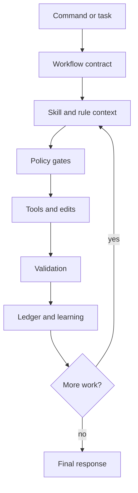

# Runtime Reference

Khala keeps the README short and moves runtime details here: safety behavior,
state locations, memory tools, and design goals.

## Runtime Behavior

When Khala is active, it adds guardrails around normal agent work:

- Mutation tools require fresh task context and preflight evidence.
- Workflows require postflight evidence and a structured final footer.
- Destructive commands are blocked unless approved.
- Empty responses, promise-only replies, repeated tool failures, duplicate
  evidence calls, and incomplete memory-gate recoveries are flagged.
- Explicit or claimed skill use must be backed by actual skill loading or
  delegated skill output.
- Workflow runs write durable events, checkpoints, completion summaries, and
  recovery classifications.
- Learning is accepted only when it is concrete, reusable, non-sensitive, and
  above quality thresholds.

Persistent defaults live in:

```text
runtime/profile.yaml
runtime/compliance/first-principles-gate.yaml
runtime/hooks/hooks.yaml
```

## Core Loop



## Storage

Khala keeps package code and mutable state separate.

| Location | Purpose |
| --- | --- |
| `runtime/` | Packaged defaults, compliance config, hook docs, and bootstrap instructions |
| `commands/` | User-facing workflow prompts |
| `workflows/` | Workflow specs queued into Pi messages |
| `skills/` | Packaged reusable skills |
| `extensions/` | Pi extension implementation |
| `scripts/` | Lightweight guard and regression checks |
| `~/.pi/agent/settings.json` | Global Pi package configuration; `pi install https://github.com/pesap/khala` writes here |
| `.pi/settings.json` | Project-local Pi package configuration; `pi install -l https://github.com/pesap/khala` writes here |
| `.pi/khala/` | Project-local Khala configuration files such as `workflow-model.yaml` |
| `~/.pi/agent/khala/` | Global Khala configuration files such as `workflow-model.yaml` |
| `~/.pi/khala/` | Mutable Khala state: memory, learned skills, rules, run ledgers, and runtime logs |

The repository intentionally ignores `.pi/`. Project-local Pi settings and
runtime artifacts are local state, not source code.

Important mutable files under `~/.pi/khala/`:

| File | Purpose |
| --- | --- |
| `runs/*.json` | Durable workflow run ledgers with events, checkpoints, resume attempts, and completion metadata |
| `memory/learning.jsonl` | Structured workflow observations |
| `memory/lessons.jsonl` | Passive lessons from corrective prompts |
| `memory/MEMORY.md` | Compact chronological memory |
| `memory/promotion-queue.md` | Candidate improvements from repeated outcomes |
| `memory/skill-curator-report.md` | Learned-skill review notes |
| `rules/active.jsonl` | Durable active runtime rules |
| `rules/session.jsonl` | Session-only rules, cleared on shutdown |
| `rules/candidates.jsonl` | Proposed rules waiting for promotion |
| `rules/audit.jsonl` | Rule hit, warn, block, reload, and promotion events |
| `rules/RULES.md` | Human-readable durable rule mirror |
| `runtime/live/dailylog.md` | Hook teardown summaries and runtime notes |

## Memory Tools

Khala exposes four memory tools to the model:

| Tool | Purpose |
| --- | --- |
| `khala_read_memory` | Read current task memory, active rules, recent learnings, and context snippets |
| `khala_search_memory` | Search older memory, rules, learned skills, prompt templates, and workflow artifacts |
| `khala_assess_learning` | Score whether a lesson is worth storing |
| `khala_learn` | Persist a structured learning record after quality checks |

> [!IMPORTANT]
> Learning is file-backed and easy to inspect. Khala stores reusable lessons and
> rules in local files, not model weights.

## Design Goals

1. Keep one canonical agent identity.
2. Make long-running work resumable and auditable.
3. Prefer small, reversible, evidence-backed changes.
4. Store learning in transparent local files, not model weights.
5. Keep startup context compact and retrieve task-specific memory on demand.
6. Let the harness improve without hiding state from the maintainer.

## Further Reading

- [workflow-model-routing.md](workflow-model-routing.md)
- [maintainer-os-north-star.md](maintainer-os-north-star.md)
- [../runtime/RULES.md](../runtime/RULES.md)
- [../runtime/INSTRUCTIONS.md](../runtime/INSTRUCTIONS.md)
